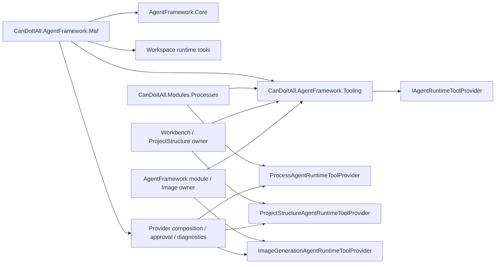

# Target Solution

## Near-Term Architecture After This Bundle

## Expected Boundary

- MAF owns provider/runtime adaptation, model execution, MAF-specific workflows, finalizers, approvals, and generic provider composition.
- Tooling owns provider-neutral tool-provider contracts and descriptors.
- Product modules own their own runtime tools through `IAgentRuntimeToolProvider` implementations.
- Processes owns process tools, access checks, process DTO tool surface, and template/process service calls.
- ProjectStructure/Workbench owns project-structure tools.
- Image-generation owner owns image-generation tools.

## Not In Scope

`CanDoItAll.Processes.Core` and process driver packs remain future work.
