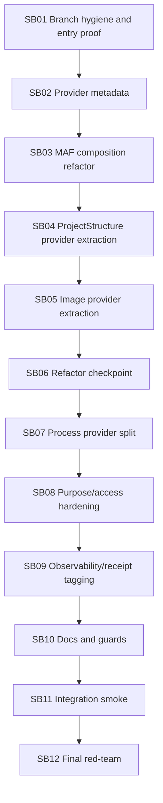

# Phase Plan

## Subbundle Dependency Map

## Critical Subbundles

| Subbundle | Critical reason |
| --- | --- |
| SB01 | Prevents branch hygiene and proof drift from contaminating all later validation. |
| SB02 | Provider metadata model shapes all later provider migrations. |
| SB03 | MAF composition must be generic before project/image providerization. |
| SB04 | First product-tool provider migration after Processes; proves pattern generality. |
| SB06 | Forced refactor checkpoint before process-provider work. |
| SB07 | Prevents Processes provider from becoming a new monolith. |
| SB08 | Purpose/access policy is prerequisite for manager verification and future drivers. |
| SB11 | Proves final runtime source shape, not just compile-time structure. |
| SB12 | Merge readiness and next-phase cutline. |

## Phase Gates

### Gate A: After SB03

Stop and review:

- Provider metadata exists.
- MAF provider composition is provider-neutral.
- Process tool parity still passes.
- No product provider migration has started before the generic seam is hardened.

### Gate B: After SB06

Stop and review:

- Project-structure and image-generation attach paths are providerized or explicitly documented as exceptions.
- MAF product-module references are reduced or allowed-listed.
- Provider composition code did not become a new monolith.

### Gate C: After SB09

Stop and review:

- Process provider is split.
- Purpose/access behavior is tested.
- Provider ownership is observable in diagnostics/proof.
- No process-core extraction has started.

### Final Gate: SB12

Close only after full build, hidden dependency scans, provider/policy tests, process evidence smoke, docs scan, and red-team review pass.
