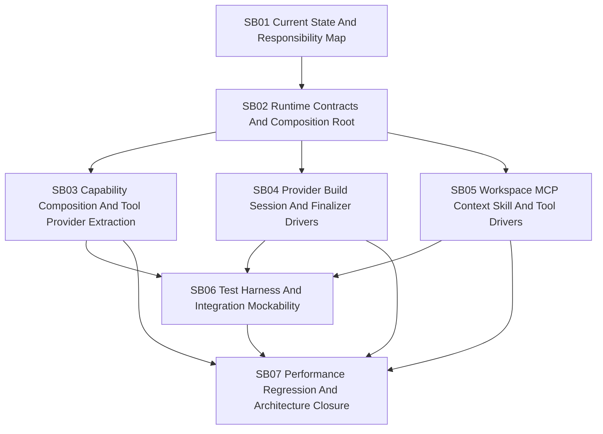

# Phase Plan

## Phase Sequence

1. SB01 maps current `MafAgentRuntime` responsibilities, tests, seams, and baseline performance/testability signals.
2. SB02 defines typed contracts, registration strategy, dependency classification, and the future composition root.
3. SB03 extracts capability composition and runtime tool-provider composition behind direct collaborators.
4. SB04 extracts provider build/session/finalizer drivers and credential/dispatch seams.
5. SB05 extracts workspace, MCP, context, skill, storage, and built-in tool feature drivers.
6. SB06 builds the test harness and integration mockability layer, then migrates reflection-heavy tests for moved behavior.
7. SB07 runs performance regression proof, behavior parity proof, architecture boundary checks, and final closure.

## Subbundle Dependency Map

## Critical Subbundles

All subbundles are critical because weak proof in any phase can leave the runtime with more files but no real isolation.

| Subbundle | Criticality | Required Gate |
| --- | --- | --- |
| SB01 | Critical foundation | Responsibility map, baseline testability/performance signals, and scope correction are complete. |
| SB02 | Critical architecture foundation | Contracts classify dependencies and define real production collaborators before extraction. |
| SB03 | Critical behavior foundation | Capability/tool-provider composition is testable outside full runtime and preserves access/approval behavior. |
| SB04 | Critical execution foundation | Provider/session/finalizer extraction preserves credential masking, disposal, streaming, and finalizer behavior. |
| SB05 | Critical feature-driver foundation | Workspace/MCP/context/skill/tool drivers are isolated without weakening policies. |
| SB06 | Critical testability foundation | Integration mockability and direct tests prove the extraction is useful, not cosmetic. |
| SB07 | Critical closure | Performance, parity, architecture boundaries, and raw-note closure are proven. |

## Phase Gates

- Gate after preparation: run the prepared-stage bundle validator and repair failures.
- Gate before SB01: confirm no production implementation starts during preparation.
- Gate after SB01: do not define contracts until the responsibility map identifies current and target owners.
- Gate after SB02: do not extract implementation until contracts, dependency classification, and registrations are reviewed.
- Gate after SB03: do not move provider/session/finalizer code if capability composition still requires private runtime reflection for moved behavior.
- Gate after SB04: do not move feature drivers until provider/session/finalizer behavior has parity tests.
- Gate after SB05: do not claim testability until feature drivers have direct tests with fake dependencies.
- Gate after SB06: do not close architecture work until reflection-heavy tests for moved behavior are reduced or explicitly justified.
- Gate before closure: rerun validators, targeted tests, architecture boundary checks, performance comparison, and raw-note closure.

## Validation Matrix

| Area | Validation Required |
| --- | --- |
| Scope | Bundle contains no Financial Strategist/margin/document/writeback implementation subbundle. |
| Responsibility map | Source-backed map from current runtime partials to target collaborators. |
| Contracts | Compile-time typed contracts, options validation, registration tests, negative missing-service tests. |
| Capability composition | Direct collaborator tests and integration parity tests for access planning, provider sorting, filtering, metadata, approval wrapping, duplicate checks. |
| Provider/session/finalizer | Direct tests for provider factory, credential resolution, dispatch gates, session build, finalizer capture/recovery/disposal. |
| Feature drivers | Direct tests for workspace, MCP, context, skill, storage, built-in tool behavior with fake dependencies. |
| Testability | Reduced reflection reliance for moved behavior; fake provider/tool/context/MCP/workspace harness. |
| Performance | Baseline and after-change timings for local runtime startup stages, separate from external provider latency. |
| Architecture boundaries | Tests or scans that block new nested driver logic inside `MafAgentRuntime` where a collaborator exists. |

## Semantic Adequacy Rules

- Each critical subbundle must create `proof/SBxx/manifest.md` and `proof/SBxx/semantic-invariants.md`.
- Proof must use production code paths. Unused wrappers, test-only fakes, or renamed partial files do not count.
- Any subbundle introducing runtime contracts, diagnostics, measurements, state records, dependency defaults, or attachment receipts must include a `## Production Behavior Artifact Matrix`.
