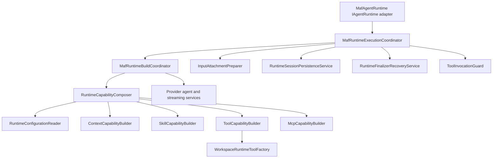

# Target Solution

## Architectural Direction

`MafAgentRuntime` should become a narrow adapter around `IAgentRuntime`. Its job should be to accept runtime calls, delegate to an execution coordinator, and return `AgentRuntimeResponse`. It should not own capability builders, configuration DTOs, tool plugins, session persistence, process-artifact parsing, or MCP client construction.

## Target Component Shape

## Boundary Rules

- `MafAgentRuntime` may depend on the execution coordinator and lightweight runtime options only.
- Builders must be top-level internal types and must not accept `MafAgentRuntime owner`.
- Configuration DTOs must be top-level internal records/classes in a runtime configuration area.
- Composition state must reference contracts or concrete collaborators by their own type names, not `MafAgentRuntime.*`.
- Workspace tool behavior must be split by responsibility: file, command, artifact/document transformation, image analysis, and access policy.
- MCP behavior must be split into local MCP client launch, hosted MCP tool creation, secret binding, schema/tool wrapping, Playwright-specific launch/cache, and model-context compaction when those behaviors need separate tests.
- Runtime execution/finalizer recovery must be independent of capability composition.
- Prefer `internal sealed` classes. Add interfaces only where DI substitution, integration mocking, or test isolation needs them.

## Proposed Runtime Areas

| Area | Target Types | Moves From |
| --- | --- | --- |
| Runtime adapter | `MafAgentRuntime` | existing public runtime methods |
| Execution | `IMafRuntimeExecutionCoordinator`, `MafRuntimeExecutionCoordinator`, `ToolInvocationGuard` | `MafAgentRuntime.cs` run loop and nested guard |
| Build | `IMafRuntimeBuildCoordinator`, `MafRuntimeBuildCoordinator` | `MafAgentRuntime.AgentFactory.cs` build/handoff build methods |
| Configuration | `MafRuntimeConfiguration`, `SkillCapabilityConfiguration`, `McpCapabilityConfiguration`, `RuntimeCompactionDecision`, etc. | private nested DTOs in `Capabilities.cs` |
| Capability composition | `IRuntimeCapabilityComposer`, `RuntimeCapabilityComposer`, `RuntimeCapabilityComposition` | `CreateCapabilityStateCoreAsync`, `CreateCapabilityComposition` |
| Context | `ContextCapabilityBuilder`, `WorkspaceMemoryContextProvider`, `StaticMessageContextProvider` | `Capabilities.Context.cs` |
| Skills | `SkillCapabilityBuilder`, `FileSkillExecutionPolicy`, skill resource DTOs | `Capabilities.Skills.cs`, nested DTOs |
| Tools | `ToolCapabilityBuilder`, workspace configured tool contributor, provider diagnostic tool contributor | `Capabilities.Tools*.cs` |
| MCP | `McpCapabilityBuilder`, `LocalMcpToolFactory`, `HostedMcpToolFactory`, `McpSecretBindingResolver`, `BrowserMcpResultCompactor` | `Capabilities.Mcp.cs` |
| Workspace | `WorkspaceRuntimeToolFactory`, `WorkspaceAccessPolicy`, `WorkspaceImageAnalysisTool`, `WorkspaceCommandToolAdapter` | `WorkspaceRuntimePlugin.cs` |
| Attachments/session | `InputAttachmentPreparer`, `RuntimeSessionPersistenceService` | `InputAttachments.cs`, session serialization methods in `MafAgentRuntime.cs` |
| Recovery/finalizer | `RuntimeFinalizerRecoveryService`, `ProcessArtifactRecoveryService`, `ProviderFailureDiagnosticBuilder` | recovery and process-artifact parsing methods in `MafAgentRuntime.cs` |

## Test Strategy

- Unit-test each extracted collaborator with minimal fakes.
- Keep runtime-level tests only for orchestration and public `IAgentRuntime` behavior.
- Add architecture guard tests that inspect source for forbidden private nested classes/builders.
- Use existing integration fakes for provider/runtime behavior, but add narrower fakes for capability builders and workspace/MCP driver seams.

## Performance Strategy

- Capture baseline capability-composition timings before extraction.
- Preserve or improve startup by avoiding eager construction of heavy services.
- Keep expensive MCP/workspace/image dependencies lazy and scoped to enabled capabilities.
- Record `IMafRuntimeCompositionMetrics` stage timings after each critical phase.
