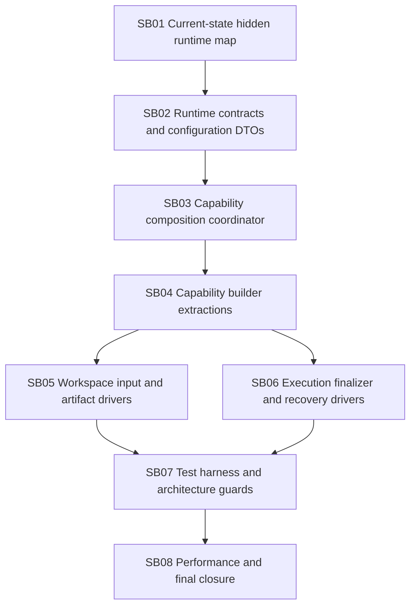

# Phase Plan

## Execution Order

1. SB01 Current-state hidden runtime map.
2. SB02 Runtime contracts and configuration DTOs.
3. SB03 Capability composition coordinator.
4. SB04 Capability builder extractions.
5. SB05 Workspace input and artifact drivers.
6. SB06 Execution finalizer and recovery drivers.
7. SB07 Test harness and architecture guards.
8. SB08 Performance and final closure.

## Subbundle Dependency Map



## Critical Subbundles

| Subbundle | Criticality | Why |
| --- | --- | --- |
| SB01 | Critical foundation | If the hidden type inventory is incomplete, downstream architecture guards will be too weak. |
| SB02 | Critical foundation | DTO/config extraction unlocks all builder extraction without circular references. |
| SB03 | Critical foundation | Composition state currently ties builders to `MafAgentRuntime`; it must be broken before builders are clean. |
| SB04 | Critical foundation | Builder extraction is the main user complaint and the central maintainability improvement. |
| SB07 | Critical closure | Guard tests prevent regression back into partial/nested runtime classes. |
| SB08 | Critical closure | Confirms runtime is thin, behavior is preserved, and performance/startup did not regress materially. |

## Phase Gates

| Phase | Entry Gate | Closure Gate |
| --- | --- | --- |
| SB01 | Bundle prepared and source tree available. | Inventory lists all current `MafAgentRuntime*.cs` files and nested runtime-owned types; architecture baseline command output captured. |
| SB02 | SB01 inventory accepted. | Runtime config/DTO types are top-level and directly testable; no extracted builder still depends on private DTOs. |
| SB03 | SB02 closure. | Capability composition coordinator owns `CreateCapabilityStateCoreAsync`/composition flow; composition record does not reference nested builder types. |
| SB04 | SB03 closure. | Context/skill/tool/MCP builders are top-level; no constructor accepts `MafAgentRuntime owner`; direct tests cover positive and negative paths. |
| SB05 | SB04 closure for tool/MCP context. | Workspace/input/artifact drivers are top-level and directly testable with fakes; host-visible command proof captured where applicable. |
| SB06 | SB03 closure and finalizer contract inventory. | Execution/finalizer/recovery/session/guard logic is in named collaborators; runtime delegates. |
| SB07 | SB04-SB06 closure. | Tests are migrated and architecture guards fail on forbidden nested builders/partials. |
| SB08 | SB07 closure. | Build/tests/performance/boundary scans recorded; bundle can honestly close or lists exact remaining blockers. |

## Validation Commands Planned

Use separate output paths if the running web app locks normal `bin` outputs.

```powershell
dotnet build src\MAF\Common\CanDoItAll.AgentFramework.Maf\CanDoItAll.AgentFramework.Maf.csproj --no-restore -p:OutDir=C:\repositories\CanDoItAll\.artifacts\maf-runtime-phase2-build\
```

```powershell
dotnet test tests\Unit\CanDoItAll.Tests.Unit\CanDoItAll.Tests.Unit.csproj --filter "FullyQualifiedName~MafRuntime|FullyQualifiedName~MafAgentRuntime|FullyQualifiedName~AgentFinalizerPolicy" --logger "console;verbosity=minimal" --no-restore -p:OutDir=C:\repositories\CanDoItAll\.artifacts\maf-runtime-phase2-unit\
```

```powershell
dotnet test tests\Integration\CanDoItAll.Tests.Integration\CanDoItAll.Tests.Integration.csproj --filter "FullyQualifiedName~MafAgentRuntimeHandoffTests" --logger "console;verbosity=minimal" --no-restore -p:OutDir=C:\repositories\CanDoItAll\.artifacts\maf-runtime-phase2-integration\
```

```powershell
rg -n "private sealed class .*Builder|private sealed partial class .*Builder|MafAgentRuntime owner|new (SkillCapabilityBuilder|ContextCapabilityBuilder|McpCapabilityBuilder|ToolCapabilityBuilder)\(this\)" src\MAF\Common\CanDoItAll.AgentFramework.Maf\Runtime -g "MafAgentRuntime*.cs"
```

## Downstream Smoke

- MAF handoff integration slice.
- Provider diagnostics unit tests.
- Runtime tool provider composition tests.
- Attachment/session serialization tests.
- Workspace command and MCP local launch tests where host-visible behavior is touched.
