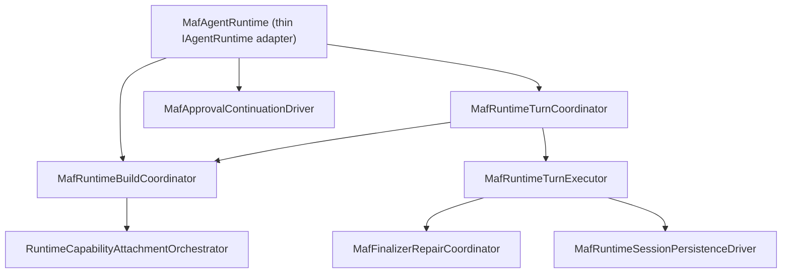

# Target Solution

## Desired Shape

`MafAgentRuntime` should remain the compatibility entry point for `IAgentRuntime`, but it should delegate to cohesive runtime services:

- provider diagnostics facade
- hosted-agent factory
- turn coordinator
- approval continuation coordinator

The extracted services should live as internal sealed types in `CanDoItAll.AgentFramework.Maf` unless SB07 proves a project boundary is needed.

## Target Runtime Flow

## Non-Goals

- Do not move every MAF file into new projects.
- Do not introduce a broad runtime service locator.
- Do not create a second runtime facade that becomes the new monolith.
- Do not convert domain-specific tool gaps into this architecture phase.
