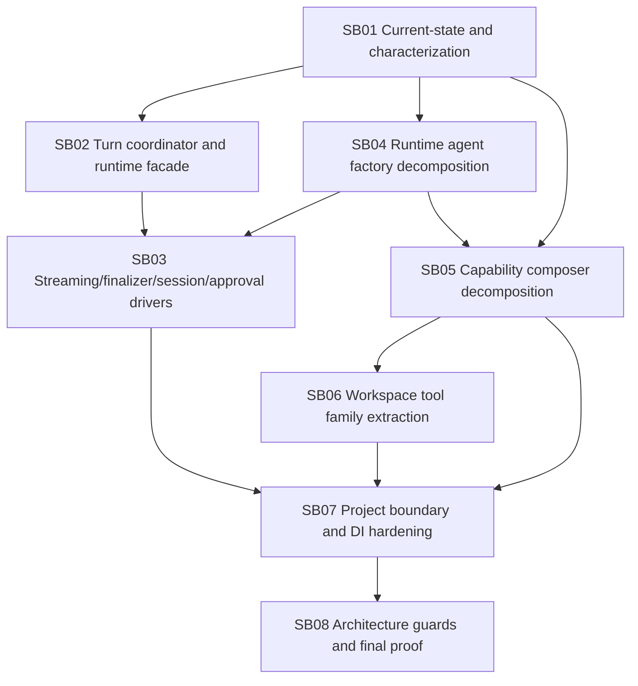

# Phase Plan

## Execution Order

1. SB01 Current-state and characterization.
2. SB02 Turn coordinator and runtime facade.
3. SB03 Streaming, finalizer, session, and approval drivers.
4. SB04 Runtime agent factory decomposition.
5. SB05 Capability composer decomposition.
6. SB06 Workspace tool family extraction.
7. SB07 Project boundary and DI hardening.
8. SB08 Architecture guards and final proof.

## Subbundle Dependency Map



## Critical Subbundles

| Subbundle | Criticality | Why |
| --- | --- | --- |
| SB01 | Critical foundation | Incomplete inventory would produce fake isolation and weak guard tests. |
| SB02 | Critical foundation | Runtime facade boundary must be corrected before execution drivers can be safely extracted. |
| SB03 | Critical foundation | Execution/finalizer/session/approval behavior is the riskiest runtime behavior and currently blocks unit testing. |
| SB04 | Critical foundation | Factory/build decomposition controls provider construction and capability composition dependency direction. |
| SB05 | Critical foundation | Composer partial cluster is a direct user complaint and blocks extension-friendly capability work. |
| SB06 | Critical architecture phase | Workspace tools are large and host-visible; weak policy tests could create security regressions. |
| SB07 | Critical closure | DI/project-boundary proof prevents service-locator and cycle regressions. |
| SB08 | Critical closure | Final source assertions and CodeAnalytics proof decide whether the architecture claim is true. |

## Phase Gates

| Phase | Entry Gate | Closure Gate |
| --- | --- | --- |
| SB01 | Prepared bundle and source tree available. | Responsibility inventory, CodeAnalytics evidence, current tests, missing tests, and characterization plan are complete. |
| SB02 | SB01 closure. | `MafAgentRuntime` delegates to turn/facade collaborators; direct coordinator tests exist; runtime behavior smoke passes. |
| SB03 | SB02 closure and characterization tests for turn execution/finalizer/session/approval paths. | Drivers have direct unit tests, negative tests, and source assertions that runtime no longer owns moved behavior. |
| SB04 | SB01 closure and provider/factory characterization tests. | Runtime build, handoff, instrumentation, finalizer tool, and script policy owners are separated and tested without full runtime. |
| SB05 | SB04 closure and capability characterization tests. | `RuntimeCapabilityComposer` is no longer a final partial boundary; extracted capability owners are directly tested. |
| SB06 | SB05 closure and workspace policy characterization tests. | Workspace tool families and shared policy services are extracted; host-visible command smoke recorded where applicable. |
| SB07 | SB03, SB05, and SB06 closure. | DI registration, project references, service-locator source assertions, and dependency/cycle proof pass. |
| SB08 | SB07 closure. | Final CodeAnalytics snapshot, focused build/tests, architecture gate, performance notes, and raw request closure are recorded. |

## Validation Commands Planned

Use separate output paths if the running web app locks normal `bin` outputs.

```powershell
dotnet build src\MAF\Common\CanDoItAll.AgentFramework.Maf\CanDoItAll.AgentFramework.Maf.csproj --no-restore -m:1 -p:OutDir=C:\repositories\CanDoItAll\.artifacts\maf-runtime-phase3-build\
```

```powershell
dotnet test tests\Unit\CanDoItAll.Tests.Unit\CanDoItAll.Tests.Unit.csproj --filter "FullyQualifiedName~MafRuntime|FullyQualifiedName~MafAgentRuntime|FullyQualifiedName~RuntimeCapabilityComposer|FullyQualifiedName~WorkspaceRuntimePlugin|FullyQualifiedName~AgentFinalizer" --logger "console;verbosity=minimal" --no-restore -p:OutDir=C:\repositories\CanDoItAll\.artifacts\maf-runtime-phase3-unit\
```

```powershell
dotnet test tests\Integration\CanDoItAll.Tests.Integration\CanDoItAll.Tests.Integration.csproj --filter "FullyQualifiedName~MafAgentRuntimeHandoffTests" --logger "console;verbosity=minimal" --no-restore -p:OutDir=C:\repositories\CanDoItAll\.artifacts\maf-runtime-phase3-integration\
```

```powershell
rg -n "partial class (MafAgentRuntime|RuntimeCapabilityComposer)|class .*Helper|class .*Utils|class .*Manager|typeof\(MafAgentRuntime\).*GetMethod|new MafAgentRuntime\(" src tests
```

## Downstream Smoke

- Provider diagnostics unit tests.
- Runtime tool provider composition tests.
- Input attachment/session serialization tests.
- MAF handoff integration slice.
- Workspace command/tool access-policy tests when SB06 moves host-visible behavior.
