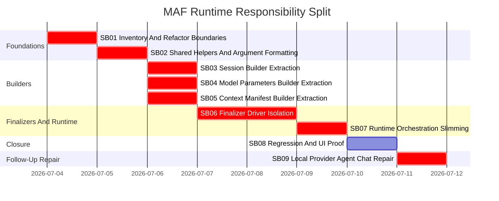

# Phase Plan

## Phase Sequence

1. SB01 inventories the current runtime responsibilities, chooses exact acceptance thresholds, and adds characterization coverage where needed.
2. SB02 extracts shared hashing and MAF argument formatting first because later phases need those helpers.
3. SB03 extracts session behavior into a builder and proves provider/session compatibility.
4. SB04 extracts model parameter behavior into a builder and proves model compatibility decisions.
5. SB05 extracts context manifest behavior into a builder and proves manifest invariants.
6. SB06 extracts finalizer behavior into a driver or strategy boundary and proves semantic finalizer behavior.
7. SB07 slims `MafAgentRuntime` orchestration and prevents catch-all relapse.
8. SB08 runs full regression and UI proof, completes raw-note closure, and performs final bundle closure.
9. SB09 repairs the follow-up Local Ollama agent-chat regression and proves local Playwright MCP tools execute through real API and UI chat flows.

## Subbundle Dependency Map

## Critical Subbundles

- SB01 is critical because it defines the responsibility map and thresholds.
- SB02 is critical because shared helper placement affects dependency direction.
- SB03, SB04, and SB05 are critical because every run depends on session, options, and manifest construction.
- SB06 is critical because finalizer behavior is process-critical and failure-prone.
- SB07 is critical because it verifies the refactor actually reduces runtime responsibility instead of hiding it.
- SB09 is critical because the reported Local Ollama symptoms show provider health/workflow success can hide an agent-chat runtime model-resolution failure, and MCP setup success can hide runtime launch/framing failure.

Critical subbundles must require Semantic Adequacy Gate proof, including shallow-pass trap, adversarial negative proof, semantic positive proof, anti-stub audit, and raw-note literal closure. Each critical subbundle must produce `proof/SBxx/manifest.md` and `proof/SBxx/semantic-invariants.md` during execution.

## Phase Gates

| Gate | Required condition |
| --- | --- |
| Prepared gate | `scripts/validate_bundle.py --stage prepared` passes and workbook exists. |
| SB01 closure | Inventory and thresholds are updated in bundle/workbook; characterization gaps are test-planned or covered. |
| SB02 entry | SB01 closure passed. |
| SB02 closure | Shared hash and MAF argument formatter behavior are tested; dependency direction is proven. |
| SB03-SB05 entry | SB02 closure passed. |
| SB03-SB05 closure | Builder-specific tests and affected runtime tests pass; source assertions prove runtime delegates to the new builder. |
| SB06 entry | SB03 closure passed and finalizer current-state tests are green before extraction. |
| SB06 closure | Finalizer semantic gate passes with negative and positive proof; integration tests prove recovery, transcript, usage, and sequencing. |
| SB07 closure | File-size/static-scan thresholds pass; no new catch-all helpers exist; full MAF build passes. |
| SB08 closure | Unit, integration, web build, Playwright UI proof, screenshot review, raw-note closure, and final validator all pass. |
| SB09 entry | Local-provider symptoms are preserved in raw inputs and the live app can be started for real API/UI proof. |
| SB09 closure | Focused unit/integration tests pass; web build passes; Local Ollama agent chat completes through API and UI; local Playwright MCP setup discovers tools with schemas; UI-started chat invokes `browser_navigate` and `browser_snapshot`; disposable test agents are cleaned up; workbook and proof manifests are updated. |

## Reopen Policy

- Any failed builder or finalizer integration test reopens the owning extraction subbundle.
- Any browser proof that shows route errors, missing diagnostics, or broken runtime state reopens the most recent subbundle that changed runtime behavior.
- Any source scan showing helper dumping grounds reopens SB07 before final closure.
- Any SB09 proof where provider/model is absent from persisted run detail, Ollama-compatible model is not used, MCP tool receipts are missing, or UI proof is API-only reopens SB09.
