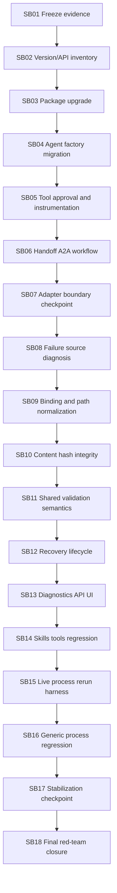

# Phase Plan

## Execution Order

1. Freeze evidence and create failing-first regression.
2. Resolve MAF 1.6 official versions and API surface.
3. Upgrade packages and pass restore/build.
4. Migrate agent factory/session/provider code.
5. Migrate tool approval, middleware, tracing, and finalizer capture.
6. Migrate handoff/A2A/workflow paths.
7. Refactor checkpoint A: MAF adapter boundary.
8. Diagnose process artifact validation failure from source.
9. Fix current-run binding and path normalization.
10. Fix content hash and lineage integrity.
11. Unify artifact satisfaction and final validation.
12. Fix recovery lifecycle and manager approval routing.
13. Expose diagnostics in API/UI.
14. Validate skills/tools/capabilities.
15. Rerun live Tetris process harness.
16. Run generic process/workflow regressions.
17. Refactor checkpoint B.
18. Final red-team closure.

## Required validation commands

```powershell
dotnet restore CanDoItAll.slnx
dotnet build CanDoItAll.slnx --no-restore
dotnet test tests/CanDoItAll.Tests.Unit/CanDoItAll.Tests.Unit.csproj --no-restore
dotnet test tests/CanDoItAll.Tests.Integration/CanDoItAll.Tests.Integration.csproj --no-restore --filter "FullyQualifiedName~Maf|FullyQualifiedName~Agent|FullyQualifiedName~ProcessRunAutomationDispatchServiceTests|FullyQualifiedName~ProcessesServiceIntegrationTests|FullyQualifiedName~ProcessTemplateGovernanceTests|FullyQualifiedName~ApiIntegrationTests"
dotnet test tests/CanDoItAll.Tests.Components/CanDoItAll.Tests.Components.csproj --no-restore --filter "FullyQualifiedName~Process"
rg -n "Microsoft\.Agents\.AI.*Version=\"1\.3|1\.3\.0-preview" src tests -S
rg -n "Sqlite|SQLite|UseSqlite|Migrations.Sqlite" src tests Templates codex -S
```


## Subbundle Dependency Map



## Critical Subbundles

- SB03 through SB07 are critical MAF foundation subbundles because all downstream agent and process execution depends on the adapter compiling and preserving behavior.
- SB08 through SB12 are critical process-runtime subbundles because they own the failed-run invariant and artifact validation semantics.
- SB13 is critical for operator diagnostics because it exposes the validation state needed to debug future failures.
- SB15 through SB18 are closure-critical because they prove the repaired runtime can run the live Blazor/Tetris process pattern and generic process regressions.

## Phase Gates

- Gate A: SB01 and SB02 must complete before any package reference changes.
- Gate B: SB03 restore/build must pass before runtime API migration proceeds.
- Gate C: SB04 through SB07 must pass MAF adapter tests before process-runtime fixes start.
- Gate D: SB08 through SB12 must pass failing-first and semantic positive artifact tests before UI/API diagnostics and live rerun proof.
- Gate E: SB13 through SB18 must pass build, targeted tests, browser validation, web-app run validation, and final bundle closure.
