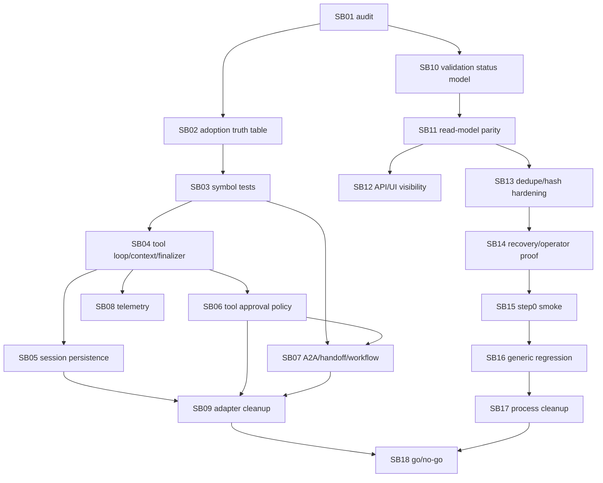

# Phase Plan

## Execution Order

1. SB01 current head and proof audit.
2. SB02 MAF 1.6 feature adoption truth table v2.
3. SB03 runtime symbol contract tests.
4. SB04 agent tool-loop/context/finalizer E2E.
5. SB05 session/stream-error persistence proof.
6. SB06 tool approval and MCP policy proof.
7. SB07 A2A/handoff/workflow capability proof.
8. SB08 OpenTelemetry trace proof.
9. SB09 refactor checkpoint A.
10. SB10 artifact validation status model expansion.
11. SB11 read-model/finalizer parity for all statuses.
12. SB12 API/UI/recovery visibility.
13. SB13 artifact dedupe/content hash race hardening.
14. SB14 recovery/operator approval final proof.
15. SB15 step0 live smoke preflight harness.
16. SB16 generic process regression.
17. SB17 refactor checkpoint B.
18. SB18 final go/no-go report.

## Subbundle Dependency Map



## Critical Subbundles

- SB04: runtime tool-loop/context/finalizer behavior is a dependency for session, policy, handoff, and telemetry proof.
- SB05: session and stream-error persistence protect recovery correctness.
- SB06: tool approval/MCP policy prevents runtime policy bypass.
- SB07: A2A/handoff/workflow proof protects cross-agent execution claims.
- SB10: validation status model expansion is the foundation for read-model parity.
- SB11: read-model parity must prove rejected artifacts never appear satisfied.
- SB12: API/UI visibility must expose invalid recorded artifacts to operators.
- SB13: dedupe/hash hardening protects artifact identity and replay integrity.
- SB14: recovery/operator approval proof prevents fake artifact completion.
- SB15: step0 smoke gates any full live UI process test.
- SB18: final go/no-go must cite actual validation proof.

## Phase Gates

- SB01 gate: no implementation starts until current source and prior proof are classified.
- SB04 gate: downstream MAF runtime proof cannot continue if finalizer/tool-loop proof is weak.
- SB10/SB11 gate: no API/UI or smoke work proceeds while any finalizer validation status can render as satisfied.
- SB12 gate: UI/API proof must show invalid recorded artifact states with diagnostic text and danger/warning tone.
- SB15 gate: full live testing remains blocked unless step0 proves finalizer result, read model, diagnostics, artifact content, content hash, and tool receipts agree.
- SB18 gate: final closure requires all completed critical proof manifests, transcripts, source assertions, anti-stub audit output, and raw-note closure rows.

## Commands

```powershell
dotnet restore CanDoItAll.slnx
dotnet build CanDoItAll.slnx --no-restore
dotnet test tests/CanDoItAll.Tests.Unit/CanDoItAll.Tests.Unit.csproj --no-restore --filter "FullyQualifiedName~Maf|FullyQualifiedName~Agent|FullyQualifiedName~ToolInvocation|FullyQualifiedName~ProcessArtifact|FullyQualifiedName~RuntimeSymbol"
dotnet test tests/CanDoItAll.Tests.Integration/CanDoItAll.Tests.Integration.csproj --no-restore --filter "FullyQualifiedName~Maf|FullyQualifiedName~Agent|FullyQualifiedName~ProcessRunAutomationDispatchServiceTests|FullyQualifiedName~ProcessesServiceIntegrationTests|FullyQualifiedName~ProcessTemplateGovernanceTests|FullyQualifiedName~ApiIntegrationTests"
dotnet test tests/CanDoItAll.Tests.Components/CanDoItAll.Tests.Components.csproj --no-restore --filter "FullyQualifiedName~Process"
rg -n "Microsoft\.Agents\.AI.*Version=\"1\.3|1\.3\.0-preview" src tests -S
rg -n "Sqlite|SQLite|UseSqlite|Migrations.Sqlite" src tests Templates codex -S
```
