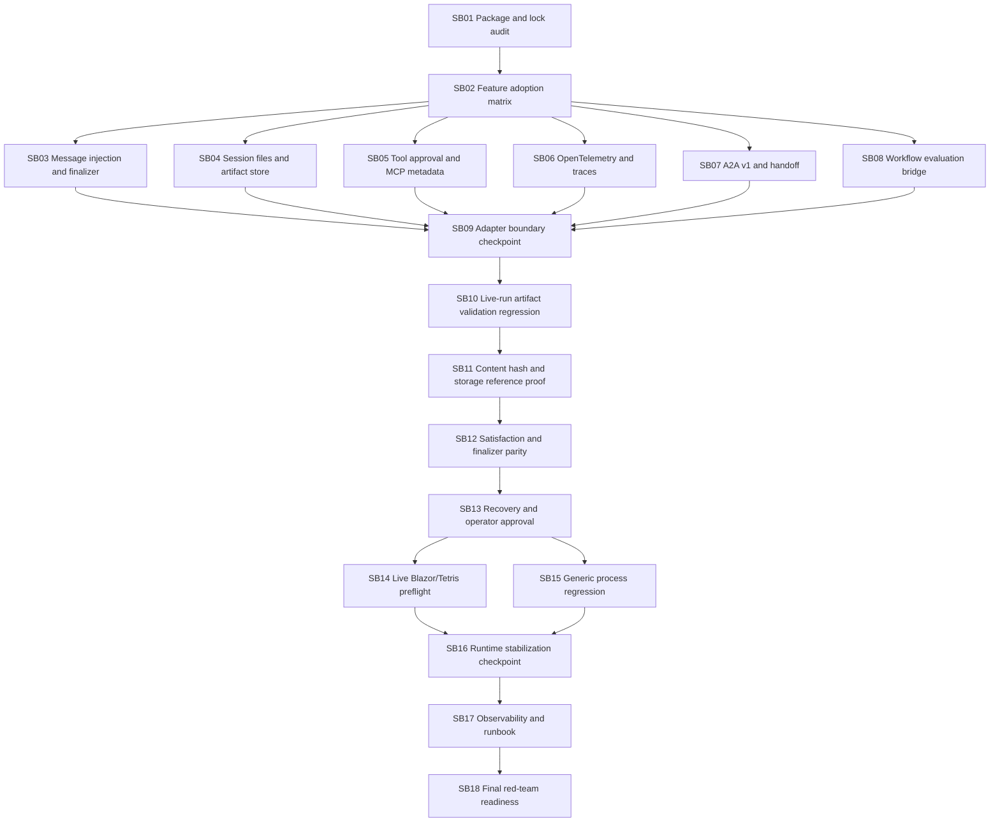

# Phase Plan

## Execution Order

1. MAF package/lock audit.
2. MAF 1.6 feature adoption matrix.
3. Message injection and finalizer structured output adoption.
4. Session files/file store artifact handling.
5. Tool approval and MCP metadata hardening.
6. OpenTelemetry and execution trace adoption.
7. A2A v1 and handoff regression.
8. Workflow evaluation and process workflow bridge.
9. Refactor checkpoint A.
10. Process artifact validation live-run regression.
11. Content hash and storage proof.
12. Satisfaction/finalizer parity.
13. Recovery/manager approval correctness.
14. Live Blazor/Tetris preflight.
15. Generic process regression.
16. Refactor checkpoint B.
17. Full live test observability/runbook.
18. Final red-team/release readiness.

## Subbundle Dependency Map



## Critical Subbundles

- SB01 is a critical foundation because it proves the upgrade baseline and prevents downstream work on stale package assumptions.
- SB02 through SB09 are critical MAF foundations because all agent execution, tool policy, finalizer, A2A, workflow, and telemetry proof depends on the adapter contract.
- SB10 through SB13 are critical process-runtime foundations because they own current-run artifact validity, content/hash semantics, read-model parity, and recovery correctness.
- SB14 through SB18 are closure-critical because they prove live process readiness, generic process behavior, web-app startup, agent communication, and release readiness.

## Phase Gates

- Gate A: SB01 must complete before any adoption decision is treated as source-backed.
- Gate B: SB02 must complete before SB03 through SB08 make MAF 1.6 adoption or deferral decisions.
- Gate C: SB03 through SB08 must close before SB09 validates the adapter boundary.
- Gate D: SB09 must close before process-runtime validation work starts.
- Gate E: SB10 through SB13 must close before live Blazor/Tetris preflight or generic process regression starts.
- Gate F: SB14 and SB15 must close before stabilization and final observability proof.
- Gate G: SB16 and SB17 must close before SB18 final red-team and completed-stage validation.

## Required Commands

```powershell
dotnet restore CanDoItAll.slnx
dotnet build CanDoItAll.slnx --no-restore
dotnet test tests/CanDoItAll.Tests.Unit/CanDoItAll.Tests.Unit.csproj --no-restore --filter "FullyQualifiedName~Maf|FullyQualifiedName~Agent|FullyQualifiedName~ToolInvocation|FullyQualifiedName~ProcessArtifact"
dotnet test tests/CanDoItAll.Tests.Integration/CanDoItAll.Tests.Integration.csproj --no-restore --filter "FullyQualifiedName~Maf|FullyQualifiedName~Agent|FullyQualifiedName~ProcessRunAutomationDispatchServiceTests|FullyQualifiedName~ProcessesServiceIntegrationTests|FullyQualifiedName~ProcessTemplateGovernanceTests|FullyQualifiedName~ApiIntegrationTests"
dotnet test tests/CanDoItAll.Tests.Components/CanDoItAll.Tests.Components.csproj --no-restore --filter "FullyQualifiedName~Process"
rg -n "Microsoft\.Agents\.AI.*Version=\"1\.3|1\.3\.0-preview" src tests -S
rg -n "IChatMessageInjector|AgentSessionFiles|SkillFrontmatter|OpenTelemetryChatClient|AsAIFunction|expected_output|ground_truth|A2A" src tests codex -S
rg -n "Sqlite|SQLite|UseSqlite|Migrations.Sqlite" src tests Templates codex -S
```
