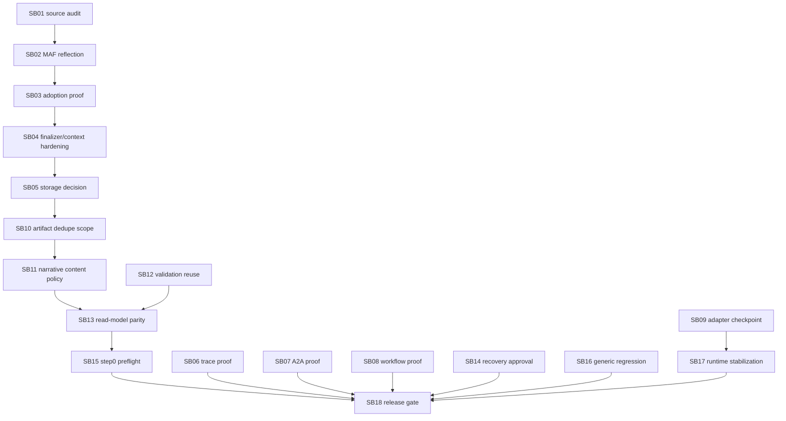

# Phase Plan

## Order

1. Current-state source and proof audit.
2. MAF 1.6 symbol/capability reflection audit.
3. Convert adoption matrix into production/runtime proof.
4. Finalizer message injection/context provider hardening.
5. Session files/file store/storage decision.
6. OpenTelemetry real trace proof.
7. A2A v1 remote/local proof.
8. Workflow evaluation expected output proof.
9. Refactor checkpoint A.
10. Artifact dedupe scope correctness.
11. Required narrative content policy.
12. Shared artifact validation service extraction.
13. Read-model/finalizer parity.
14. Recovery/operator approval correctness.
15. Live run preflight + Tetris step0 smoke.
16. Generic business/agent-training regression.
17. Refactor checkpoint B.
18. Final release gate and real-test runbook.

## Execution Order

- SB01 through SB09 audit the package, adapter, and previous proof surface before runtime behavior changes.
- SB10 through SB14 close the process artifact correctness risks.
- SB15 through SB18 provide deterministic preflight, regression coverage, stabilization, and release-readiness proof.

## Subbundle Dependency Map



## Critical Subbundles

- SB02: runtime reflection proof for real MAF 1.6 symbols.
- SB10: projection identity and external reference dedupe scope proof.
- SB11: required narrative artifact content policy.
- SB13: read-model and health parity for content-unavailable artifacts.
- SB18: final release gate, bundle validation, and runbook closure.

## Phase Gates

- Gate 1: source audit and reflection proof must complete before any runtime claims are accepted.
- Gate 2: artifact dedupe and content policy tests must pass before read-model parity is trusted.
- Gate 3: read-model parity must pass before live-run readiness is reported.
- Gate 4: bundle prepared and completed validators must pass before final closure.

## Commands

```powershell
dotnet restore CanDoItAll.slnx
dotnet build CanDoItAll.slnx --no-restore
dotnet test tests/CanDoItAll.Tests.Unit/CanDoItAll.Tests.Unit.csproj --no-restore --filter "FullyQualifiedName~Maf|FullyQualifiedName~Agent|FullyQualifiedName~ToolInvocation|FullyQualifiedName~ProcessArtifact"
dotnet test tests/CanDoItAll.Tests.Integration/CanDoItAll.Tests.Integration.csproj --no-restore --filter "FullyQualifiedName~Maf|FullyQualifiedName~Agent|FullyQualifiedName~ProcessRunAutomationDispatchServiceTests|FullyQualifiedName~ProcessesServiceIntegrationTests|FullyQualifiedName~ProcessTemplateGovernanceTests|FullyQualifiedName~ApiIntegrationTests"
dotnet test tests/CanDoItAll.Tests.Components/CanDoItAll.Tests.Components.csproj --no-restore --filter "FullyQualifiedName~Process"
rg -n "Microsoft\.Agents\.AI.*Version=\"1\.3|1\.3\.0-preview" src tests -S
rg -n "IChatMessageInjector|AgentSessionFiles|SkillFrontmatter|OpenTelemetryChatClient|MessageAIContextProvider|A2A|expected_output|ground_truth" src tests codex -S
rg -n "Sqlite|SQLite|UseSqlite|Migrations.Sqlite" src tests Templates codex -S
```
