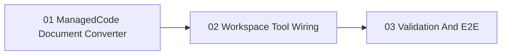

# Phase Plan

## Execution Order

1. `subbundles/01-managedcode-document-converter`
2. `subbundles/02-workspace-tool-wiring`
3. `subbundles/03-validation-and-e2e`

## Phase Sequence

### Phase 1 - Converter Implementation

1. Add Core converter request/result/interface contracts.
2. Add `ManagedCode.MarkItDown` package reference to Tools.Documents.
3. Implement `ManagedCodeMarkItDownDocumentMarkdownConverter`.
4. Add direct converter tests with a small deterministic HTML/text fixture.

### Phase 2 - Workspace Tool Wiring

1. Inject the converter into `WorkspaceArtifactToolService`.
2. Create workspace receipts and previews from conversion result.
3. Update DI composition in Hosting, Module host, and `MafRuntimeDependencyResolver`.
4. Update tool descriptions to say ManagedCode.MarkItDown.
5. Add fake-converter tests for success and failure paths.

### Phase 3 - Validation And E2E

1. Run focused unit tests.
2. Build affected projects and app host.
3. Capture CodeAnalytics/dependency evidence.
4. Restart the 5032 app.
5. Use project-structure floating agent chat against the quotation PDF project.
6. Inspect agent run logs/tool events for converter access, timing, and errors.

## Subbundle Dependency Map

## Critical Subbundles

- `SB01` / `01-managedcode-document-converter`: introduces the concrete dependency and must compile before runtime wiring.
- `SB02` / `02-workspace-tool-wiring`: changes the agent-visible tool path and must preserve receipts/previews.
- `SB03` / `03-validation-and-e2e`: proves the app and agent path instead of only the library.

## Phase Gates

- Phase 1 closes only after direct converter tests pass.
- Phase 2 closes only after artifact-service and DI tests pass.
- Phase 3 closes only after build, CodeAnalytics evidence, 5032 restart, and floating-chat proof are recorded.

## Gate

Close only after conversion works through the live runtime path. If node creation is blocked by Financial Strategist write permissions, record that as a separate policy issue rather than disguising it as a conversion failure.
