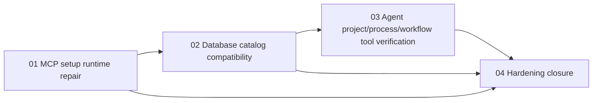

# Phase Plan

## Phase Sequence

1. Repair MCP setup runtime registration and local stdio execution.
2. Update persisted capability model and seed refresh behavior.
3. Verify agent access to internal project/process/workflow tooling.
4. Run focused backend/component tests and large-screen Playwright MCP validation.
5. Update this bundle and run the bundle validator.

## Subbundle Dependency Map

## Critical Subbundles

- `01-mcp-setup-runtime-repair` unlocks live setup tests and UI proof.
- `02-database-catalog-compatibility` unlocks refresh of stale managed development workspace records.
- `03-agent-process-workflow-tool-verification` proves that internal runtime tool access remains intact after retiring project/process MCP records.

## Phase Gates

- Gate after phase 1: setup API and MCP unit tests pass.
- Gate after phase 2: live workspace record contains v25 and `newlineDelimitedJson`.
- Gate after phase 3: seed/runtime-provider/process launch tests pass.
- Gate after phase 4: Playwright MCP setup UI shows `Setup passed`; related pages load at `1920x1080`.
- Gate before closure: bundle validator passes and app is running on port 5032.
