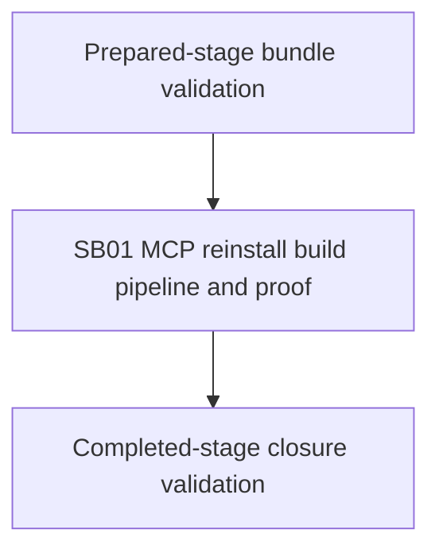

# Phase Plan

## Phase Sequence

1. Run prepared-stage bundle validation.
2. Execute `SB01 MCP reinstall build pipeline and proof`.
3. Capture proof artifacts and run SB01 closure gate.
4. Run completed-stage bundle validation and final closure audit.

## Subbundle Dependency Map

## Critical Subbundles

- `SB01` is process-critical because it changes the host installer path that configures all repo-managed MCP servers and skills.
- Deeper validation required: Semantic Adequacy Gate, full reinstall transcript, artifact scan, source assertions, changed-file hashes, anti-stub audit, and final verifier artifact.

## Phase Gates

| Subbundle | Prerequisites | Gate | Downstream dependency |
| --- | --- | --- | --- |
| SB01 | Prepared-stage bundle validation passes; source references exist. | Full reinstall transcript passes, MCP artifact outputs do not contain copied `Templates`, critical proof manifest exists, and raw notes are closed. | Final bundle closure and future MCP setup depend on this proof. |
