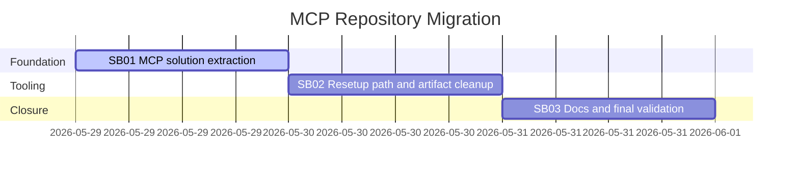

# Phase Plan

## Execution Order

1. Run the prepared-stage bundle validator.
2. Execute `SB01` to migrate source/tests/tools and create the standalone MCP solution.
3. Run `SB01` entry and closure gates with build/test proof.
4. Execute `SB02` to update resetup tooling and clean MCP artifacts.
5. Run `SB02` closure gate with resetup and cleanup proof.
6. Execute `SB03` to write docs and run final validation.
7. Run completed-stage bundle validation and close raw note `N001`.

## Subbundle Dependency Map

## Critical Subbundles

- `SB01` is a critical foundation because later resetup and docs are invalid unless the standalone MCP solution builds and the main solution no longer owns migrated MCP projects.
- `SB02` is a critical foundation because final closure depends on resetup building from `C:\repositories\CanDoItAll.Mcp`, syncing skills from `repo://codex/skills`, and removing historical MCP artifacts.
- `SB03` is final verification and documentation closure; it depends on `SB01` and `SB02` proof.

## Phase Gates

- Prepared gate: `python C:\Users\lucys\.codex\skills\candoitall-bundle-preparation\scripts\validate_bundle.py --profile initiative --stage prepared --repo-root C:\repositories\CanDoItAll codex\bundles\mcp-repo-migration-v1`.
- `SB01` entry gate: current MCP source/test/tool paths exist in the main repo, destination repo exists, and exact source references still match the repo.
- `SB01` closure gate: new MCP solution builds/tests, migrated project refs are removed from `repo://CanDoItAll.slnx`, and critical proof manifest `bundle://proof/SB01/manifest.md` exists.
- `SB02` entry gate: `SB01` is completed and the new MCP solution path is stable.
- `SB02` closure gate: resetup uses `$McpRepoRoot` for MCP build paths, uses `$RepoRoot` for settings/skills/artifacts, cleanup proof exists, and critical proof manifest `bundle://proof/SB02/manifest.md` exists.
- `SB03` closure gate: MCP repo docs exist, execution report closes `N001`, completed-stage validator passes, and no suppressed MCP install remains.
