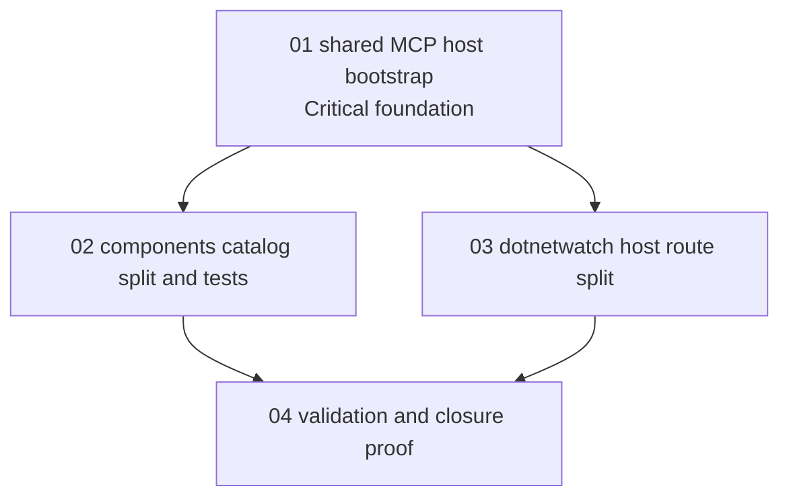

# Phase Plan

## Execution Order

1. Prepare and validate this bundle.
2. Execute `01-01-shared-mcp-host-bootstrap` as the critical foundation.
3. Execute `02-02-components-catalog-split-and-tests` after shared helper proof passes.
4. Execute `03-03-dotnetwatch-host-route-split` after shared helper proof passes.
5. Execute `04-04-validation-and-closure-proof` after all refactor subbundles close.

## Subbundle Dependency Map

## Critical Subbundles

- `01-01-shared-mcp-host-bootstrap` is a critical foundation because every migrated server depends on preserved configuration, logging, and options behavior.
- `02-02-components-catalog-split-and-tests` is not a foundation for other subbundles, but it must close before final validation because it owns the largest cross-component file split.
- `03-03-dotnetwatch-host-route-split` is not a foundation for other subbundles, but it must close before final validation because DotNetWatch has the highest host complexity.

## Phase Gates

- Prepared gate: run `validate_bundle.py --stage prepared --profile initiative` and repair any bundle defects before editing code.
- Subbundle 01 entry gate: verify source references exist, no prerequisite subbundle is required, and the shared helper belongs in `CanDoItAll.Mcp.Core`.
- Subbundle 01 closure gate: targeted shared-helper tests pass and affected MCP host projects build.
- Subbundle 02 entry gate: subbundle 01 completed; component catalog baseline tests identified.
- Subbundle 02 closure gate: component catalog tests pass and catalog public behavior is preserved.
- Subbundle 03 entry gate: subbundle 01 completed; DotNetWatch route references still match `Program.cs`.
- Subbundle 03 closure gate: DotNetWatch tests/build pass and backend route wrapper remains behaviorally equivalent.
- Final closure gate: run targeted MCP tests, focused build, prepared/completed bundle validation, raw-note closure audit, and final git diff review.
