# Phase Plan

## Phase Sequence

1. Validate preparation and architecture gate.
2. Execute SB01-SB03 serially through the shared agent API/model surfaces.
3. Execute SB04-SB05 serially through the shared workflow API/model surfaces.
4. Execute SB06 only after typed run identities from the earlier contracts are stable.
5. Execute SB07 against the complete route/DTO surface.
6. Execute SB08 from the exact generated OpenAPI artifact.
7. Audit N001-N007 and close the bundle.

## Subbundle Dependency Map

```mermaid
flowchart LR
  SB01["SB01 Remote package import"] --> SB02["SB02 External-key provisioning"]
  SB02 --> SB03["SB03 Portable JSON Schema"]
  SB03 --> SB04["SB04 Workflow stable-key lookup"]
  SB04 --> SB05["SB05 Workflow run idempotency"]
  SB05 --> SB06["SB06 Agent recruiting evidence"]
  SB06 --> SB07["SB07 OpenAPI response contracts"]
  SB07 --> SB08["SB08 SharedInfo skills/docs"]
  SB08 --> CLOSE["Raw-note closure audit"]
```

## Critical Subbundles

- SB02, SB03, SB05, and SB06 are critical Behavioral foundations.
- SB01, SB04, and SB07 are Behavioral.
- SB08 is Standard plus canonical host capture.
- Each closure gate requires exact targeted tests and an architecture checkpoint before
  the next subbundle starts.

## Phase Gates

- Gate after preparation: `validate_bundle.py --stage prepared`, bundle validator, and
  C# architecture review.
- Gate before each subbundle: confirm prerequisites are complete and still valid.
- Gate after each subbundle: capture semantic positive/adversarial proof and decide whether
  downstream work may continue.
- Gate before closure: rerun validators, close raw notes, and reopen anything with weak proof.

## UI Target Policy

- N/A. No UI surface is authorized.
