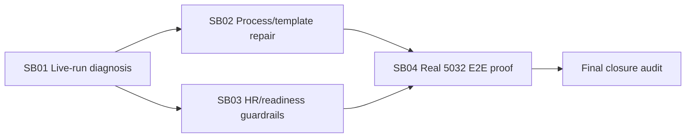

# Phase Plan

## Phase Sequence

1. Diagnose the live 5032 run and capture the failing operation contracts.
2. Repair process templates and subprocess boundaries, then run template projection tests.
3. Repair HR/readiness capability checks, then run resolver/runtime integration tests.
4. Rebuild, restart 5032, reload templates into the development database, and launch a fresh Calculator run for real proof.
5. Update proof manifests and close the bundle only after the real-run evidence is attached.

## Subbundle Dependency Map

- SB02 and SB03 may be implemented in parallel after SB01, but SB04 cannot start until both pass targeted tests.

## Critical Subbundles

- SB01 is critical because the fix must match the actual escalation, not a guessed failure.
- SB02 is critical because bad process contracts directly produce wrong tool availability and repeated child launches.
- SB03 is critical because HR/readiness must prevent recurrence when a template or agent capability is incomplete.
- SB04 is critical closure because static tests alone cannot prove autonomous multiteam runtime behavior.

## Phase Gates

- Gate after preparation: run the bundle validator and repair failures.
- Gate before each subbundle: confirm prerequisites are complete and still valid.
- Gate after each subbundle: capture proof, review screenshots, and decide whether downstream work may continue.
- Gate before closure: rerun bundle validation, targeted tests, solution build, runtime restart, template reload check, and real 5032 run proof.
