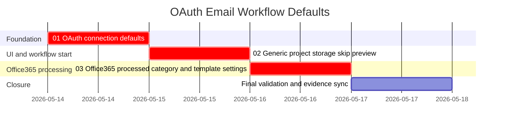

# Phase Plan

## Phase Sequence

1. Prepare and validate the focused feedback bundle.
2. Execute `01-oauth-connection-defaults`.
3. Execute `02-generic-project-storage-skip-preview`.
4. Execute `03-office365-processed-category-and-template-settings`.
5. Run targeted tests and a browser pass on the Project Structure start dialog.
6. Close raw notes and run the completed-stage validator.

## Subbundle Dependency Map

## Critical Subbundles

- `01-oauth-connection-defaults` is a critical foundation because email workflows cannot reach summary or storage steps while blank connection ids fail early.
- `02-generic-project-storage-skip-preview` is a critical UI/runtime foundation because the start dialog, start API contract, simulation plan, and project-structure executor context fallback must agree.
- `03-office365-processed-category-and-template-settings` is critical because the default Office365 workflow must avoid reprocessing the same category email and the Run Preview skip option depends on strongly typed template settings.

## Phase Gates

- Prepared gate: bundle validator and `validate_bundle.py --stage prepared` pass or all failures are repaired.
- `01` entry gate: source references exist and no prerequisite implementation is required.
- `01` closure gate: blank `connectionId` resolves only to an enabled connected OAuth connection; invalid explicit ids still fail.
- `02` entry gate: `01` closure proof is complete; workflow start dialog and service source references are current.
- `02` closure gate: Project Structure start dialog exposes generic project-structure write skip options and selected skips are passed into runtime.
- `03` entry gate: `01` and `02` closure proof is complete; Office365 plugin, template loader, and workflow template source references are current.
- `03` closure gate: Office365 category mutation is implemented, required Graph scopes are requested, seeded Office365 workflow includes the mark-processed step, and template scalar settings deserialize correctly.
- Final closure gate: targeted tests, build, browser proof, and raw-note closure rows agree.
