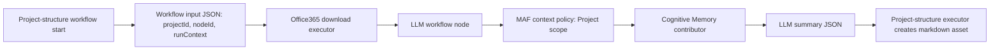

# Target Solution

## Design

- Add an optional `ContextWorkspaceScope` to `AgentRuntimeExecutionOptions`.
- Keep `MafAgentRuntime.CreateCapabilityStateAsync` behavior for existing callers, and introduce a core path that accepts an explicit context workspace scope.
- In `MafWorkflowLlmComponentInvoker`, parse workflow input JSON and set `ContextWorkspaceScope` when `projectId` or `project.id` is a non-empty GUID.
- In `CognitiveMemoryAgentContextContributor`, keep missing scope and recall exceptions as failures for governed automation, but treat an empty context pack as an explicit skipped contribution with trace metadata.

## Boundaries

- No changes to Office365 Graph behavior.
- No changes to project-structure lease enforcement.
- No hidden fallback when project scope is absent.
- No UI changes.

## Data Flow

