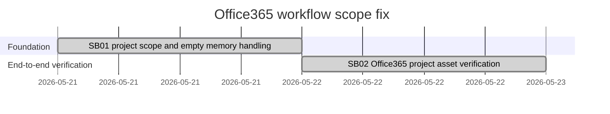

# Phase Plan

## Phase Sequence

1. SB01: propagate workflow project scope into MAF context contributors and preserve strict Cognitive Memory governance.
2. SB02: verify the Office365 email summary workflow creates the markdown asset under the workflow node.
3. Closure: run targeted unit and integration tests, then run the real development database workflow and capture proof.

## Subbundle Dependency Map

## Critical Subbundles

- SB01 is critical because Cognitive Memory scope must be correct before the LLM node can execute safely.
- SB02 is critical because it proves the Graph/OAuth, LLM, project-structure executor, and category mutation path in the development database.

## Phase Gates

- SB01 gate: unit tests show scope override reaches contributors and empty context packs skip without hiding recall exceptions.
- SB02 gate: integration test and live Office365 run complete, with asset parent and summary content verified.
- Closure gate: proof manifests cite command transcripts, semantic invariant contracts, and live-run evidence.
