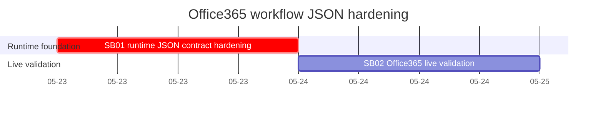

# Phase Plan

## Phase Sequence

1. SB01 hardens the workflow LLM runtime contract and proves invalid JSON is still rejected.
2. SB02 validates the Office365 summary workflow against the local running app or records an explicit live-validation blocker.
3. Final closure audits raw notes N001-N004, proof manifests, changed-file hashes, source assertions, and command transcripts.

## Subbundle Dependency Map

- SB02 must not start until SB01 closure proof shows provider response-format options are passed and malformed JSON is still rejected.

## Critical Subbundles

- SB01 is a critical foundation. If it is wrong, downstream live validation can still fail with invalid JSON or pass only because of prompt luck.
- SB01 requires Semantic Adequacy Gate proof, including a shallow-pass trap, adversarial invalid-output proof, semantic positive response-format proof, anti-stub audit, and raw-note closure.
- The live validation phase depends on SB01; it is not a critical foundation for further code changes.

## Phase Gates

- Prepared gate: `python <bundle-validator> --stage prepared codex\bundles\office365-workflow-json-output-hardening`.
- SB01 entry gate: raw failure, runtime source, template schema, and unit-test file references still exist.
- SB01 closure gate: focused unit tests pass, production source assertions are recorded, `proof/SB01/manifest.md` and `proof/SB01/semantic-invariants.md` exist, and downstream SB02 can rely on JSON response-format enforcement.
- SB02 entry gate: SB01 is completed and the app at `http://localhost:5032` is reachable or the validation blocker is recorded.
- SB02 closure gate: live Office365 run/inspection proof exists, or the exact live blocker plus alternate command/API proof is captured.
- Final closure gate: completed-stage validator passes and `reviews/01-execution-report.md` closes N001-N004.
