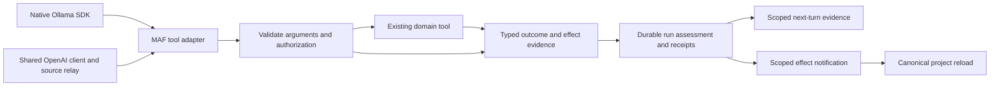

# Target Solution

Preserve the existing application above provider transports. Add trusted outcome information at the tool invocation boundary and consume the same information everywhere else.

## Decisions

- Keep schema-shaped arguments. Diagnose the actual nested contract rather than silently translating arbitrary snake_case or flattening every tool.
- Return safe validation diagnostics in a normal correlated tool-result message so the model can correct an unexecuted call. Preserve the invocation's failed status separately from the fact that an error message was delivered.
- Assess attempted mutations using typed status/effect evidence and explicit recovery correlation. Do not use final prose, an unrelated later tool success, or an unknown result as success proof.
- Represent post-commit failure separately from an unexecuted failure. Notify the UI about trusted committed effects even if the run fails afterward.
- Project bounded prior outcomes into the next turn from canonical application data after current scope/permission checks. Do not restore stale approval state or treat model-authored JSON as a receipt.
- Use existing enum/record owners. No new project is needed for this bounded repair. Concrete policies are enough unless an actual external dependency needs substitution.
- Add no unconditional automatic mutation retry. Model correction can execute once after a known pre-execution failure and normal authorization. Unknown commit requires readback/reconciliation or an explicit failure.

The implementation must preserve existing cancellation, approval, finalizer and background-continuation semantics; these are inputs to the assessment, not conditions to overwrite.

## SDK baseline

Execute SB00 first. MAF 1.20 remains below the application outcome policy in this diagram. Experimental route-persisting clients are not part of the target solution; canonical safe tool evidence remains the cross-provider authority.
