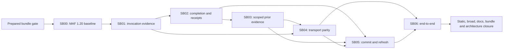

# Phase Plan

## Phase Sequence

1. SB00 upgrades MAF 1.18 to 1.20 with aligned dependencies and freezes the actual SDK behavior baseline.
2. Validate SB00; SB01 establishes trusted, safe invocation feedback and outcome evidence.
3. Validate SB01's Governed gate; SB02 makes completion and durable/public receipts truthful.
4. Validate SB02; SB03 projects bounded prior tool evidence with current authority.
5. Validate Governed SB03; SB04 proves direct/shared schema, correlation and error parity.
6. Validate transport parity; SB05 makes asset commit evidence and canvas refresh effect-aware.
7. Validate integration/component/browser results; SB06 executes deterministic and live acceptance, then final closure.
8. If any gate fails or an invalidation key changes, reopen the earliest owner and dependent phases before continuing.

## Subbundle Dependency Map

## Critical Subbundles

| Phase | Tier | Why critical | Downstream check |
|---|---|---|---|
| SB00 | Behavioral | Freezes coherent SDK/dependency and workflow behavior before repairs. | SB01–SB06 assumptions use the post-upgrade baseline. |
| SB01 | Governed | Defines trusted outcome and safe feedback boundary. | SB02/SB03/SB04/SB05 consume exact contract; reopen all on change. |
| SB02 | Behavioral | Defines truthful terminal and durable/public state. | SB03/SB05/SB06 compare receipts and status. |
| SB03 | Governed | Carries trust across turns and provider switches. | SB04 continuation and SB06 two-turn isolation. |
| SB04 | Behavioral | Proves provider endpoint equivalence at the real relay. | SB05 live prerequisites and SB06 matrix. |
| SB05 | Behavioral | Makes committed effect visible and safe under later failure. | SB06 canonical/UI agreement. |
| SB06 | Behavioral | Closes the user's observable behavior and full validation. | Final closure only. |

Governed manifests and transcripts apply to SB01/SB03 at execution closure, not preparation.

## Phase Gates

- Preparation: prepared-stage bundle validator, C# architecture review, documentation validation and secret scan pass. No product behavior claim.
- SB00: resolved package closure, production solution build, focused agent/workflow/MCP/A2A/schema tests and static gate establish the post-upgrade baseline.
- Entry: verify all prerequisites and baseline source have not invalidated prior proof.
- Closure: build changed production owners; list expected focused tests; execute the exact filter; run required static checks; capture semantic/browser proof; update execution report.
- Progression: verify dependent input contract and record Pass/Blocked. Do not continue with weak or unexpected test discovery.
- Final: frozen broad gate once for named shared receipt/persistence invalidation, final portability enforcement, docs validation, completed bundle validator, architecture closure and raw-note audit.

## UI Target Policy

The application target is the 2048×1100 large-screen desktop state represented by the report. No mobile or BaseLib responsive work is in scope. Existing project canvas is primary; contextual chat and runtime details are supporting overlays with their own scroll. Components MCP must be retried before any markup change.
