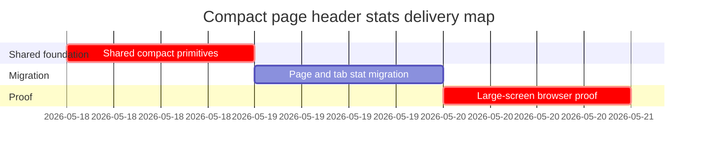

# Phase Plan

## Phase Sequence

1. `01-shared-compact-header-primitives`: add and prove shared compact stat/action/header support.
2. `02-page-and-tab-stat-migration`: migrate identified production page headers and tab/subpage stat rows.
3. `03-large-screen-browser-proof`: build, run browser validation, capture screenshots, and close raw notes.

## Subbundle Dependency Map

## Critical Subbundles

- `01-shared-compact-header-primitives` is a critical UI foundation because tooltip delay, icon-only action semantics, and badge spacing are inherited by every migrated page.
- `03-large-screen-browser-proof` is critical closure because the request is visual and height-focused.

## Phase Gates

- Gate after preparation: run `validate_bundle.py --stage prepared` and repair failures.
- Gate before `02`: `01` must build and expose shared primitives without page-local policy duplication.
- Gate before `03`: inventory sweep must show no targeted page/header/tab `SummaryTiles` or header `MetricCard` rows remain in the migrated production surfaces.
- Gate before closure: run build/tests as feasible, capture large-screen screenshots for representative routes, prove delayed tooltip behavior, and close N001-N008 note by note.
