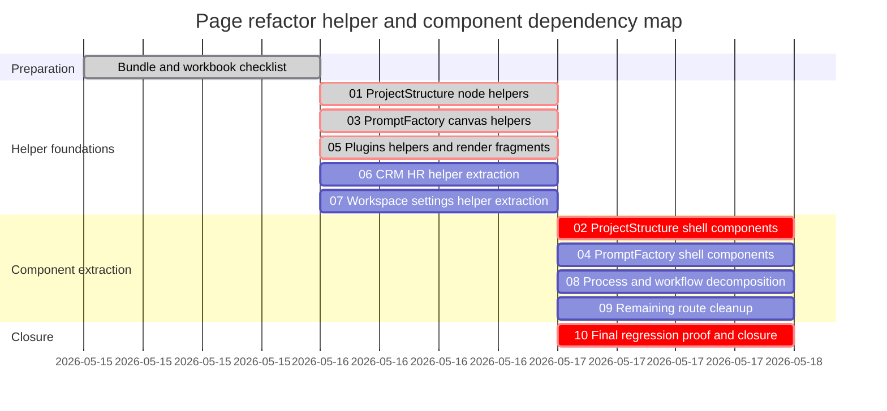

# Phase Plan

## Phase Sequence

1. Complete the workbook checklist and pass the prepared-stage bundle validator.
2. Execute helper extraction first: subbundles `01`, `03`, `05`, `06`, and `07`.
3. Execute component extraction after helper foundations pass: subbundles `02`, `04`, `08`, and `09`.
4. Finish with cross-surface regression, browser proof, raw-note closure, and completed-stage validation in subbundle `10`.

## Subbundle Dependency Map

## Critical Subbundles

- `01-project-structure-node-helpers`: critical foundation for all ProjectStructure component extraction and attachment preview behavior.
- `03-prompt-factory-canvas-helpers`: critical foundation for PromptFactory component extraction and canvas/session behavior.
- `05-plugin-page-helpers-and-render-fragments`: critical foundation for plugin settings, OAuth, connection test ids, and package actions.
- `02-project-structure-page-shell-components`: critical UI foundation because it changes the most complex browser-visible route.
- `10-final-regression-proof-and-closure`: critical final gate because the user explicitly required preserved functionality.

## Phase Gates

- Prepared gate: run `C:\Users\lucys\.codex\skills\candoitall-bundle-preparation\scripts\validate_bundle.py --stage prepared` and repair all failures before code changes.
- Entry gate before each helper subbundle: confirm exact source references still exist, source methods still match the checklist, and no prerequisite is weak.
- Closure gate after each helper subbundle: run targeted component/unit tests and prove no downstream component extraction is blocked by helper state coupling.
- Entry gate before each component subbundle: confirm helper foundations are complete and re-check BaseLib or CanvasLib component guidance.
- Closure gate after each component subbundle: run targeted tests, browser route proof, screenshot review, and execution-report updates.
- Final gate: run targeted tests, `dotnet build CanDoItAll.slnx`, Playwright route smoke proof, completed-stage bundle validator, and note-by-note raw request closure.
