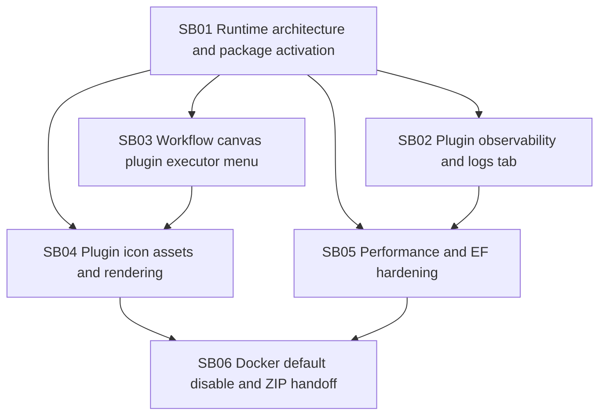

# Phase Plan

## Phase Sequence

1. Fix the runtime package activation contract and remove bundled-only runtime assumptions where they block real package behavior.
2. Add durable plugin logs and expose installation/runtime logs in the plugins page.
3. Rebuild workflow canvas right-click executor grouping so plugin executors live behind plugin grouping.
4. Add the shared icon contract and assets for Docker, Gmail, and Office365.
5. Apply targeted performance and EF hardening after the core contracts are stable.
6. Remove Docker from default registration, build/test the Docker runtime ZIP, and leave the app running without Docker by default.

## Subbundle Dependency Map

## Critical Subbundles

- SB01 is the critical foundation. If runtime package activation still accepts bundled descriptors from installed package assemblies, Docker ZIP handoff is invalid.
- SB02 is critical for diagnosability. Later validation must use durable plugin logs to diagnose install/runtime failures.
- SB03 and SB04 are UI foundations for the requested workflow canvas behavior.
- SB05 is a hardening pass that must not hide earlier architectural bugs behind caching.
- SB06 is the closure gate and must prove the app runs without default Docker.

## Phase Gates

- Gate after preparation: run the bundle validator and repair failures.
- Gate before each subbundle: confirm prerequisites are complete and source references still match.
- Gate after SB01: prove a package assembly can register an executor without contributing bundled plugin identity.
- Gate after SB02: prove durable installation and runtime logs can be listed separately in the plugins page.
- Gate after SB03: prove plugin executors are not direct children of `Executors` in the context menu.
- Gate after SB04: prove icons render in plugins page, context menu, and executor node.
- Gate after SB05: prove targeted EF/performance findings are resolved or explicitly deferred with evidence.
- Gate after SB06: prove Docker is absent by default, Docker ZIP installs/activates correctly, and the running app ends without Docker default registration.

## Validation Commands Expected Across The Bundle

- `dotnet build C:\repositories\CanDoItAll\CanDoItAll.sln`
- Targeted unit tests for package activation, log persistence, icon resolution, and menu grouping.
- Targeted integration tests for package install/activation and Docker ZIP.
- Targeted component tests for plugins page log subtab.
- Browser proof for `/plugins` and the workflow canvas route used by the existing app.

## Execution Report Requirement

Every subbundle must append to `reviews/01-execution-report.md` with:

- source changes summary
- tests/commands and results
- browser screenshots or reason browser proof is not applicable
- residual risks
- next gate status
