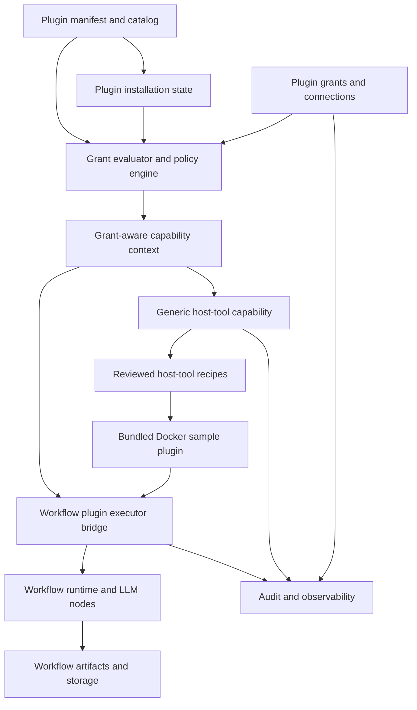

# Target Solution

## Architecture Decision

The current plugin catalog should be kept, but it must become only one layer in a larger plugin runtime. The target architecture separates four concerns:

- Manifest catalog: what a plugin declares and what version was installed.
- User grants: what the user explicitly approved for a plugin, connection, and optional workflow scope.
- Runtime facades: grant-aware proxies exposed to plugin code.
- Host-tool recipes: reviewed, typed, auditable operations that can run local commands without exposing arbitrary shell access.

## Target Dependency Shape

## Core Runtime Boundary

- The plugin runtime builds `IPluginCapabilityContext` per invocation from manifest declarations, persisted grants, connection state, workflow node settings, and policy.
- Each capability property must be a proxy with the minimum required access. A missing grant must produce an explicit denial, not a null object that hides the issue.
- Plugin code must not resolve arbitrary application services. The existing guardrail that prevents public `IServiceProvider` exposure should be extended to host tools and workflow runtime services.
- Secret resolution must flow through one canonical plugin secret contract or an explicit adapter between abstraction and security modules.

## Permission Model

- Manifest capability: static declaration packaged with the plugin.
- Grant: persisted approval for a plugin capability and optional connection, host recipe, resource scope, workflow scope, and expiration.
- Policy evaluation: runtime decision that checks declaration, installation, enablement, connection, grant, app policy, and recipe policy.
- Grant state must support at least `Requested`, `Granted`, `Denied`, `Revoked`, and `Unavailable`.
- Risk level must be explicit for UI and audit: low for read-only metadata, medium for storage/files, high for host commands, PowerShell, Docker start/pull, and secret access.

## Host Tool Model

- Add a generic host-tool capability, not a Docker-specific plugin-core interface.
- Define reviewed recipe identifiers as strongly typed values. Examples: Docker list containers, Docker pull image, Docker start container, Docker read logs, PowerShell run reviewed script.
- A recipe owns argument validation, path validation, environment shaping, timeout, cancellation, output caps, receipt creation, and audit metadata.
- PowerShell remains behind recipe grants. A plugin never receives "run this command line" authority.
- Docker recipe policy denies dangerous options by default and exposes only the supported typed parameters.

## Docker Sample Workflow

- Sample plugin executor `Docker.ListContainers` returns bounded container metadata.
- Sample plugin executor `Docker.PullImage` validates registry/image/tag policy and returns receipt metadata.
- Sample plugin executor `Docker.StartContainer` starts with constrained arguments and returns container identity and receipt metadata.
- Sample plugin executor `Docker.ReadLogs` requires tail/since/max-character limits and returns a bounded preview plus artifact reference when needed.
- Sample workflow path: Docker logs node -> LLM call node -> summary artifact or workflow result node.
- The LLM node consumes bounded text or an artifact reference. Docker plugin code does not receive LLM credentials or model invocation capability for this scenario.

## Persistence Model

- Keep `PluginInstallationRecord` focused on installation snapshot state.
- Add separate records for plugin connections, capability grants, host-tool recipe grants, connection secret bindings if missing, and audit metadata.
- Grant and connection records require unique indexes by plugin id, connection id, capability kind, recipe id, and scope where relevant.
- Records that users mutate require concurrency tokens and update timestamps.
- Read models should project directly into DTOs for settings pages and workflow validation.

## Performance And EF Position

- Current catalog all-load behavior is acceptable only for the bundled catalog scale.
- Grant checks in workflow execution must avoid one query per node per capability. Load scoped grant snapshots per run or per workflow validation pass.
- Do not introduce compiled queries until measurements show repeated hot-path query overhead. Start with correct projections and indexes.
- Docker logs must flow through artifact/storage infrastructure. EF stores metadata, preview length, truncation flags, receipt references, and summary references.

## UI Position

- The plugins page should become a settings surface with actions and permission inspection, not just a catalog card list.
- Permission controls must show declared capability, requested grant, current grant state, risk level, actor, updated timestamp, and reason when unavailable.
- Workflow editor must display plugin executor unavailable states caused by disabled plugin, missing connection, or missing grant before execution.
