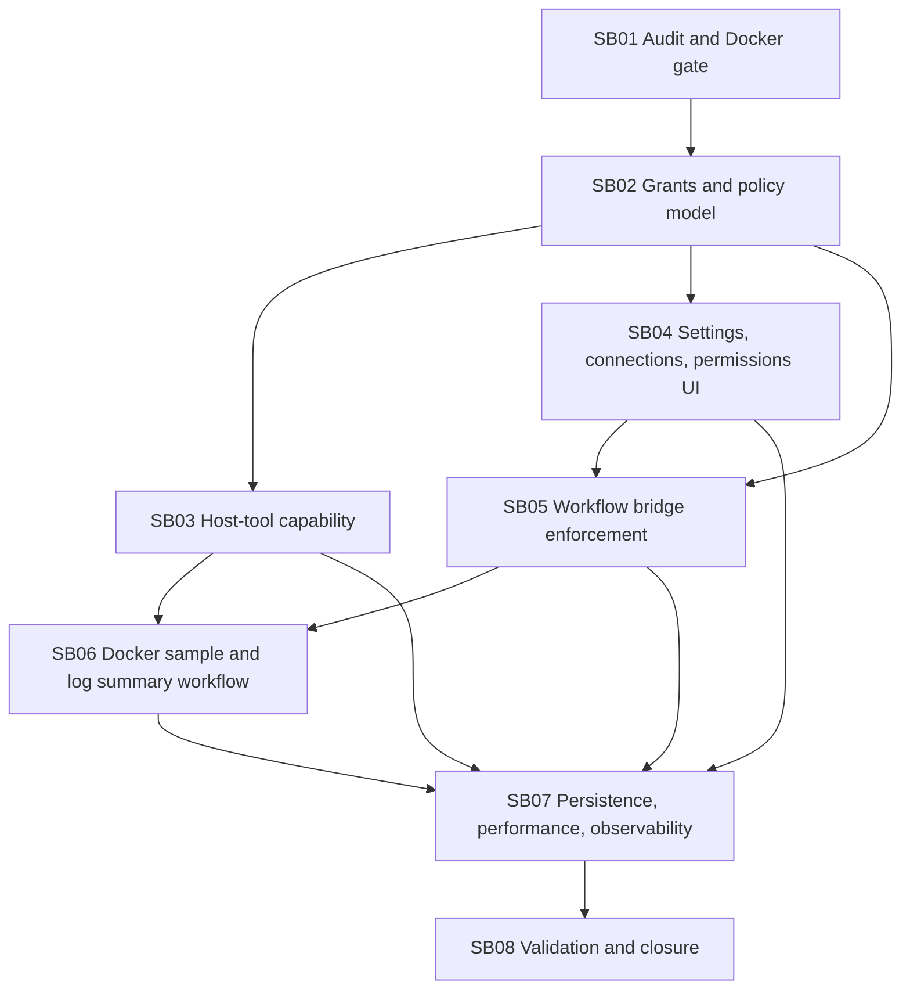

# Phase Plan

## Execution Order

1. Complete the current implementation audit and Docker use-case gate.
2. Implement the plugin permission grant and policy model.
3. Add the controlled host-tool and command capability.
4. Add plugin settings, connection management, and permission UI/API.
5. Add workflow plugin bridge enforcement.
6. Add the bundled Docker sample plugin and log-summary workflow, including Qdrant start-container proof.
7. Harden persistence, performance, EF query shape, and observability.
8. Run final validation, architecture review, browser proof review, and closure.

## Subbundle Dependency Map

## Critical Subbundles

- `SB01`: critical discovery gate. It prevents implementation from building on an incomplete or misunderstood plugin-wave state.
- `SB02`: critical architecture foundation. All later runtime, UI, host-tool, and workflow work depends on a correct grant model.
- `SB03`: critical safety foundation. Docker and PowerShell must not proceed until host-tool recipes are typed, grant-aware, audited, and bounded.
- `SB04`: critical UI/API foundation. Users need explicit permission controls before Docker-style plugins can be legitimately run.
- `SB05`: critical runtime foundation. Workflow validation and runtime must enforce the same grants; otherwise UI consent is decorative.
- `SB07`: critical closure foundation. It verifies EF, performance, observability, and payload behavior after earlier slices are integrated.

## Phase Gates

- Preparation gate: run `python C:\Users\lucys\.codex\skills\candoitall-bundle-preparation\scripts\validate_bundle.py C:\repositories\CanDoItAll\codex\bundles\plugin-runtime-governance-docker-refactor --profile initiative --stage prepared`.
- Entry gate before each subbundle: confirm prerequisite subbundles are complete and `reviews/01-execution-report.md` reflects the current state.
- Exit gate after `SB02`: no downstream subbundle may proceed unless install, enablement, grants, and declarations are separate in code and tests.
- Exit gate after `SB03`: no Docker work may proceed unless raw shell/PowerShell exposure is impossible through plugin-facing APIs.
- Exit gate after `SB04`: no workflow bridge work may rely on permissions until UI/API grant persistence is proven.
- Exit gate after `SB05`: Docker sample work must not proceed until workflow validation and runtime both reject missing grants.
- Exit gate after `SB06`: Docker proof must include bounded logs, a separate LLM summary-compatible node, and a workflow path that starts or verifies a Qdrant vector database container.
- Closure gate after `SB08`: rerun bundle validator at completed stage, targeted tests, browser validation, architecture review, and raw-note closure table.
