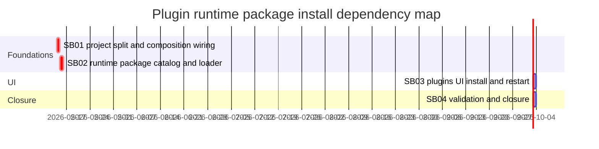

# Phase Plan

## Phase Sequence

1. Split concrete plugin implementations into `src/plugins` projects and update composition wiring.
2. Add package manifest, catalogue, upload/install, startup loader, and restart-state services.
3. Add `/plugins` UI controls for catalogue install, zip upload, and graceful restart.
4. Run build, targeted tests, browser proof, validators, and raw-note closure.

## Subbundle Dependency Map

## Critical Subbundles

- `SB01` is a critical foundation. If concrete plugin registrations remain in `CanDoItAll.Modules.Plugins`, the package architecture is not clean enough for runtime-loaded plugins.
- `SB02` is a critical foundation. If package install does not persist package contents, expose descriptors, and mark restart-required state, the UI would be cosmetic.
- `SB03` is UI-critical. If browser proof is missing, the user-facing install/restart request cannot be considered complete.

## Phase Gates

- Preparation gate: run `validate_bundle.py --profile initiative --stage prepared` and repair failures before implementation.
- SB01 entry gate: confirm current plugin implementation paths and existing tests still match source.
- SB01 closure gate: build succeeds and catalog tests still see Docker/Gmail/Office365 through composition.
- SB02 entry gate: SB01 complete; plugin module no longer directly registers concrete bundled plugin types.
- SB02 closure gate: package install tests cover catalogue install, upload install, invalid manifest, traversal rejection, catalog visibility, and restart-required state.
- SB03 entry gate: SB02 package services are callable from DI and API.
- SB03 closure gate: component tests and browser proof show catalogue install, upload affordance, and restart action.
- SB04 closure gate: targeted build/tests pass, browser analytics rows are filled, raw notes are closed, and completed-stage bundle validation passes.
