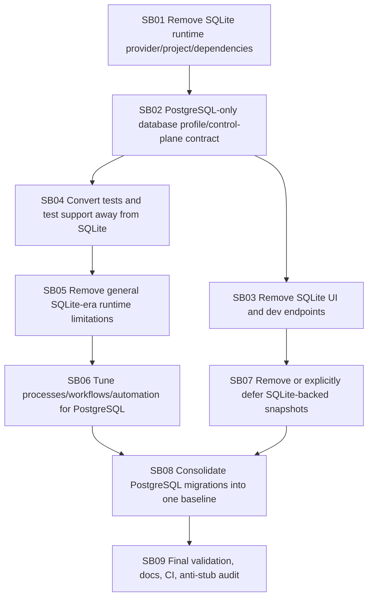

# CanDoItAll PostgreSQL-Only Main Runtime Bundle v1

Prepared: 2026-05-23 19:05:22 UTC

## Purpose

This bundle gives Codex an execution-grade, dependency-aware plan for removing SQLite completely from the **main CanDoItAll runtime** on branch `development`.

The intended end state is:

- Main CanDoItAll application runtime persistence is **PostgreSQL-only**.
- SQLite is removed from the main `AppDbContext`, runtime provider switching, profile control plane, UI, tests, migration projects, and workflow/process runtime assumptions.
- Current SQLite-backed snapshot/materialization flows are removed or explicitly deferred.
- PostgreSQL migrations are consolidated into one clean baseline after the model is stable.
- CanDoItAll.IPFS remains untouched, because its local SQLite explorer index is an isolated utility store and not part of the main application persistence.

## Repository scope

Target repository:

```text
fyziktom/CanDoItAll
branch: development
```

Explicitly out of scope:

```text
fyziktom/CanDoItAll.IPFS
```

The IPFS repo has its own isolated `Microsoft.Data.Sqlite` store for the NodeControl explorer index. Do not modify that repo in this bundle.

## Required execution order



## Critical rule

Do not start PostgreSQL-specific process/workflow tuning before the main SQLite runtime/provider/profile/UI/test surfaces have been removed and validated.

## Bundle layout

```text
inputs/             User request and repository observations.
analysis/           Current-state analysis, risk register, dependency map.
requirements/       Normalized implementation requirements and out-of-scope rules.
architecture/       Target persistence architecture.
plan/               Phase plan and execution gates.
inventories/        SQLite removal inventory.
traceability/       Input-to-subbundle and source-to-subbundle matrices.
shared-prompts/     Reusable Codex and QA prompts.
subbundles/         Detailed execution instructions for each phase.
proof/              Expected proof manifests and semantic invariants.
reviews/            Preparation review and execution-report template.
scripts/            Audit scripts.
templates/          Proof/report templates.
```

## Start here

For Codex, use:

```text
COPY_PASTE_PROMPT_FOR_CODEX.md
```

Then execute subbundles in numeric order.
