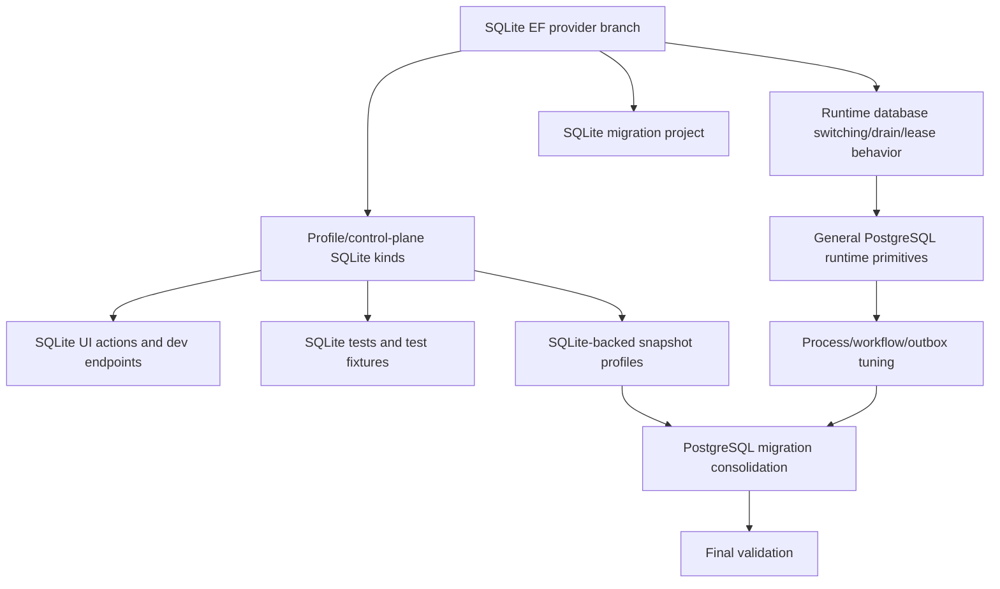

# Dependency map

Key ordering principle:

1. Remove provider/project/dependencies.
2. Remove profile contract and UI/test references.
3. Remove general limitations.
4. Tune process/workflow specifics.
5. Remove/defer snapshot paths.
6. Consolidate PostgreSQL migrations.
7. Validate.
