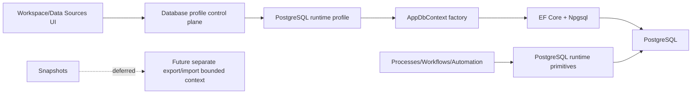

# Target persistence architecture

## Target rule

```text
Main runtime persistence = PostgreSQL only.
```

## Allowed stores

| Store type | Allowed? | Notes |
|---|---:|---|
| Main `AppDbContext` runtime provider: PostgreSQL | Yes | Only persistent runtime provider |
| Main `AppDbContext` runtime provider: SQLite | No | Remove completely |
| Main `AppDbContext` runtime provider: InMemory | Limited | Only for narrow unit/non-persistence tests if still needed |
| Local utility SQLite store outside main runtime | Yes, out of scope | Example: CanDoItAll.IPFS NodeControl explorer index |
| Future snapshot SQLite/export store | Deferred | Separate bounded context only, not runtime provider |

## Target runtime dependency graph



## Target profile contract

- No SQLite provider kind.
- No SQLite source kind.
- No materialized SQLite snapshot profile.
- No SQLite path/fingerprint in profile connection objects.
- Legacy SQLite catalog entries must be unsupported and clearly reported.

## Target process/workflow persistence

After SQLite is removed, runtime code can use PostgreSQL-native patterns:

- Transaction-safe work claiming.
- Row-level locks where appropriate.
- `FOR UPDATE SKIP LOCKED` where appropriate.
- PostgreSQL advisory locks only if they fit the domain.
- Better worker concurrency defaults.
- Idempotent outbox execution.
