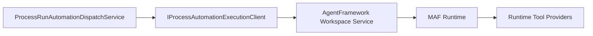
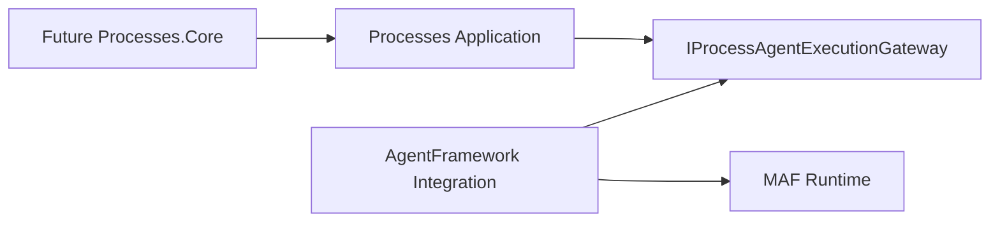

# Target Solution

## End State After This Bundle

The dispatcher remains in `CanDoItAll.Modules.Processes`, but its direct AgentFramework execution calls are hidden behind a process automation execution boundary. This is a staging seam, not the final clean core.

## Boundary Rules

- MAF stays product-tool-neutral.
- Tooling stays product-neutral.
- Processes may still reference AgentFramework Core during this staging bundle, but only through a small client/facade after SB06.
- New contracts/abstractions must not reference Razor, EF, MAF, Workbench, or provider-specific implementation packages.
- Receipt and artifact validation stay behaviorally identical.

## Final Desired Direction Later

This later direction is not fully implemented by this bundle.
