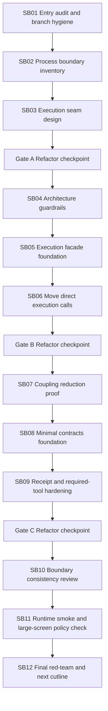

# Phase Plan

## Subbundle Dependency Map

## Critical Subbundles

| Subbundle | Criticality | Why |
| --- | --- | --- |
| SB01 | Critical | Establishes clean baseline and rejects previous-regression drift |
| SB03 | Critical | Defines seam before movement |
| SB04 | Critical | Adds guardrails before production changes |
| SB06 | Critical | Moves direct execution calls and can regress runtime behavior |
| SB09 | Critical | Protects receipt/artifact semantics |
| SB12 | Critical | Final closure and next-phase Process Core cutline |

## Phase Gates

### Gate A after SB03

- Inventory complete.
- Execution seam design approved.
- No production movement yet except tests/scans.
- Large-screen-only proof policy recorded.

### Gate B after SB06

- Dispatcher execution path uses facade/client for start/detail/adoption/recovery calls.
- Targeted tests pass.
- Source scans prove direct call reduction.

### Gate C after SB09

- Receipt/required-tool/artifact lineage tests pass.
- Contracts foundation has not absorbed EF/UI/Maf dependencies.
- No mobile/small/medium proof artifacts.

## Implementation Cadence

Codex should work subbundle by subbundle. After each gate, perform a source-size and dependency review before continuing.
