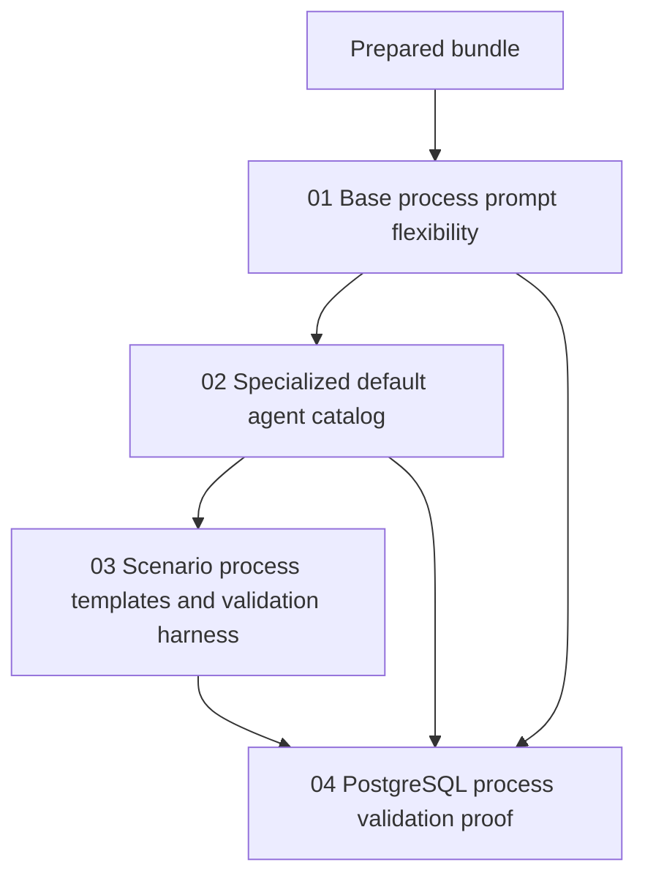

# Phase Plan

## Phase Sequence

1. Prepare and validate this bundle.
2. Execute subbundle 01 to neutralize the base process prompt and preserve generic evidence rules.
3. Execute subbundle 02 to add specialized managed default agents and instruction assets.
4. Execute subbundle 03 to add a non-coding business-plan process template and deterministic validation harness.
5. Execute subbundle 04 to run PostgreSQL-backed process validation and attempt a real-agent scenario.
6. Run final raw-note closure, bundle validator, and completed-stage validator.

## Subbundle Dependency Map

- `01` must complete before any agent/process proof is trusted because it removes global prompt bias.
- `02` must complete before real-agent scenario proof because staffing must have the target default agents.
- `03` must complete before PostgreSQL process validation because the new non-coding process template is part of the scenario surface.

## Critical Subbundles

- `01-base-process-prompt-flexibility`: Critical foundation. Deeper proof requires prompt absence/presence tests for coding and non-coding examples.
- `02-specialized-default-agent-catalog`: Critical foundation for real-agent validation. Deeper proof requires seed catalog tests and managed seed refresh/fallback coverage.
- `04-postgresql-process-validation-proof`: Process-critical closure. Deeper proof requires PostgreSQL-backed execution, not SQLite.

## Phase Gates

- Gate after preparation: `Passed`.
- Gate before subbundle 01: `Passed`.
- Gate after subbundle 01: `Passed`.
- Gate before subbundle 02: `Passed`.
- Gate after subbundle 02: `Passed`.
- Gate before subbundle 03: `Passed`.
- Gate after subbundle 03: `Passed`.
- Gate before subbundle 04: `Passed`.
- Gate after subbundle 04: `Passed`.
