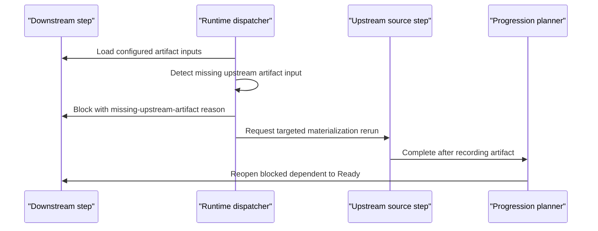

# Target Solution

## Runtime Boundaries

- Dispatch proof validation stays in `ProcessRunAutomationDispatchService`.
- Step transition and reactivation behavior stays in `ProcessRuntimeProgressionPlanner`.
- Process definitions remain generic; no product-specific rule is added.
- Agent rerun directives carry materialization instructions to the source step through existing process rerun infrastructure.

## Data Flow

## Genericity

The flow is driven by artifact input definitions and step dependencies. It does not inspect product language, framework, route, or domain terms.
