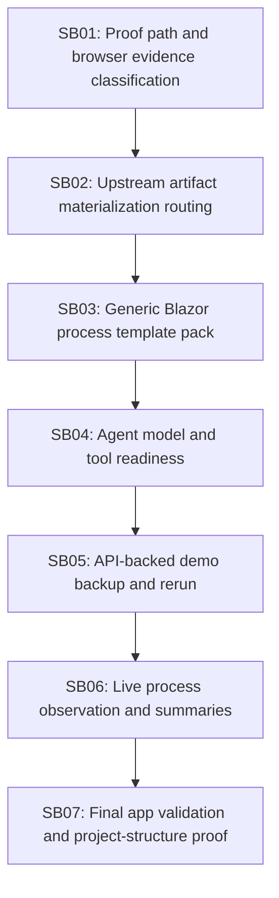

# Phase Plan

## Execution Order

1. `SB01`
2. `SB02`
3. `SB03`
4. `SB04`
5. `SB05`
6. `SB06`
7. `SB07`

## Phase Sequence

`SB01` repairs the proof false positives/negatives that caused the current live block. `SB02` repairs the upstream materialization flow requested by the user. `SB03` adds generic Blazor process templates and evidence contracts. `SB04` proves staffing, model, and tool readiness. `SB05` backs up and seeds the demo via APIs. `SB06` runs and observes the process as a user. `SB07` independently validates the final agent-built app and closes the loop.

## Subbundle Dependency Map

## Critical Subbundles

- `SB01`: critical because proof classification controls whether implementation and browser evidence can be trusted.
- `SB02`: critical because missing upstream artifacts otherwise leave the process blocked or retrying the wrong step.
- `SB03`: critical because Blazor-specific behavior must be process-owned rather than runtime-owned.
- `SB04`: critical because a correct process still fails if HR assigns agents without the needed model/tools.
- `SB05`: critical because rerunnable demo data and output isolation must be deterministic.
- `SB06`: critical because large runs need compact evidence and user-observation trails.
- `SB07`: critical because the final promise is a working agent-built app with screenshots and console proof.

## SB01

- Fix managed current-run output source reads.
- Tighten result-summary browser evidence classification.
- Add regression tests for both failures.

## SB02

- Carry source step metadata with artifact input records.
- Block downstream dispatch when configured upstream artifact inputs are missing.
- Request targeted rerun of the source agent-owned step.
- Reopen downstream blocked dependents after the source completes.
- Add progression regression test.

## SB03

- Add generic Blazor process templates for new app delivery, repair/fix, backend feature, frontend feature, and backend+frontend feature.
- Include build/test/runtime/browser proof expectations in template artifact contracts.
- Keep all Blazor-specific requirements in template JSON/Markdown and sidecar prompts.
- Add tests that the template pack loads and projected envelopes contain required evidence terms.

## SB04

- Confirm `gpt-5.4-mini` is the active model for CanDoItAll agents used in the run.
- Analyze HR launch-plan assignments and whether selected agents have required capabilities.
- Add or repair generic agent/tool instructions only where the platform already models those instructions.

## SB05

- Start a current PostgreSQL-backed runtime and disable cognitive memory through the settings API.
- Back up existing demo project-structure data and assets via API.
- Seed clean basic-info project-structure records through API only.
- Import/link the selected Blazor process definition through API.

## SB06

- Launch the process via API, act as user for approvals/escalations, and record UX observations through API records.
- Capture compact run summaries and evidence indices after each meaningful run phase.
- Read raw run data selectively only when summaries point to a concrete gap.

## SB07

- Let agents finish app delivery and self-validation.
- Independently validate the output without editing generated product files.
- Capture browser screenshots, console output, and runtime state.
- Classify any failure as skills, permissions, staffing, process design, or runtime automation.

## Phase Gates

| Gate | Criteria | Status |
| --- | --- | --- |
| `G1` Live DB mapped | Run, steps, artifacts, and failure reason recorded | Passed |
| `G2` SB01 tests | Implementation proof and browser evidence ref regressions pass | Passed |
| `G3` SB02 tests | Downstream no-retry and upstream completion reactivation pass | Passed |
| `G4` Dispatch class regression | Full `ProcessRunAutomationDispatchServiceTests` class passes | Passed |
| `G5` Template-pack regression | Blazor templates load, project, and expose required proof contracts | Pending |
| `G6` Runtime readiness | PostgreSQL runtime ready, cognitive memory disabled, `gpt-5.4-mini` available | Pending |
| `G7` Backup and seed | Current project-structure data/assets backed up via API and clean basic-info seed created | Pending |
| `G8` HR/tool readiness | Launch plan assignments audited and accepted or repaired before execution | Pending |
| `G9` Live process run | Process completes or produces classified blocker evidence | Pending |
| `G10` Final browser proof | Independent browser validation captures screenshots and console/runtime proof | Pending |
