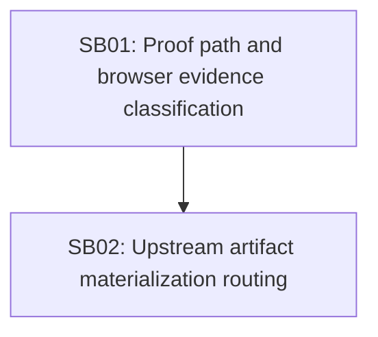

# Phase Plan

## Execution Order

1. `SB01`
2. `SB02`

## Phase Sequence

`SB01` repairs the proof false positives/negatives that caused the current live block. `SB02` repairs the upstream materialization flow requested by the user.

## Subbundle Dependency Map

## Critical Subbundles

- `SB01`: critical because proof classification controls whether implementation and browser evidence can be trusted.
- `SB02`: critical because missing upstream artifacts otherwise leave the process blocked or retrying the wrong step.

## SB01

- Fix managed current-run output source reads.
- Tighten result-summary browser evidence classification.
- Add regression tests for both failures.

## SB02

- Carry source step metadata with artifact input records.
- Block downstream dispatch when configured upstream artifact inputs are missing.
- Request targeted rerun of the source agent-owned step.
- Reopen downstream blocked dependents after the source completes.
- Add progression regression test.

## Phase Gates

| Gate | Criteria | Status |
| --- | --- | --- |
| `G1` Live DB mapped | Run, steps, artifacts, and failure reason recorded | Passed |
| `G2` SB01 tests | Implementation proof and browser evidence ref regressions pass | Passed |
| `G3` SB02 tests | Downstream no-retry and upstream completion reactivation pass | Passed |
| `G4` Dispatch class regression | Full `ProcessRunAutomationDispatchServiceTests` class passes | Passed |
