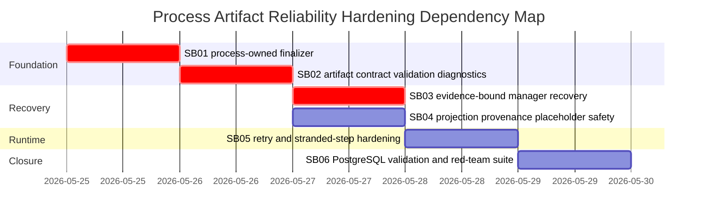

# Phase Plan

## Phase Sequence

1. `SB01` creates the process-owned step completion finalizer and routes all executor outcomes through it.
2. `SB02` adds artifact contract validation, durable diagnostics, and artifact modes/profiles.
3. `SB03` hardens manager recovery, manager eligibility, and recovery provenance.
4. `SB04` hardens projection safety, stale-file checks, placeholder/gap separation, and subprocess projection behavior.
5. `SB05` hardens retry, stranded-step, and invariant-failure handling.
6. `SB06` runs PostgreSQL-only validation and red-team regression closure.

## Subbundle Dependency Map



## Critical Subbundles

- `SB01` is a critical foundation. If a workflow-backed role bypasses the finalizer, all downstream artifact proof is untrustworthy.
- `SB02` is a critical foundation. If artifact validity is not modeled, recovery and retry logic will still operate on weak signals.
- `SB03` is a critical foundation. If recovery can invent evidence or use the wrong manager, final process output cannot be trusted.

## Phase Gates

### Prepared Bundle Gate

Run from the repository root after copying this bundle into `codex/bundles/process-artifact-reliability-hardening`:

```powershell
python codex/skills/bundles/candoitall-bundle-preparation/scripts/validate_bundle.py --stage prepared codex/bundles/process-artifact-reliability-hardening
```

Then run the bundle validator skill if available:

```text
candoitall-bundle-validator readiness gate
```

### SB01 Closure Gate

- Source assertions show every executor path enters the finalizer.
- Direct agent and workflow-backed role tests both fail before implementation and pass after implementation.
- No workflow module owns process artifact expectation validation.

### SB02 Closure Gate

- Artifact validation result model exists.
- Required artifacts are not complete unless validation passes.
- Diagnostics are persisted for required artifact failures.
- Response-text negative tests pass.

### SB03 Closure Gate

- Recovery manager eligibility is explicit.
- Recovered artifacts include provenance and are revalidated.
- Insufficient evidence creates blocked diagnostics, not fabricated artifacts.

### SB04 Closure Gate

- Existing managed files require current-run/carry-forward validation.
- Placeholder/gap records cannot satisfy required expectations.
- Subprocess projection behavior is verified and hardened.

### SB05 Closure Gate

- Repeated invariant artifact failures stop blind retry and route to recovery/blocking.
- Stranded missing artifacts are recovered or blocked deterministically.

### SB06 Closure Gate

- Focused integration tests pass.
- PostgreSQL migration/model validation is recorded if data model changed.
- Full solution build passes or a blocker is recorded.
- No SQLite residue was introduced.
