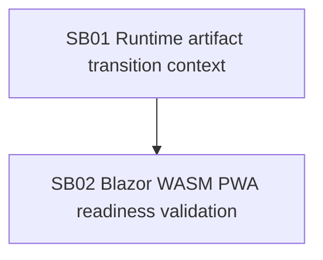

# Phase Plan

## Execution Order

1. SB01 repairs runtime transition artifact validation context.
2. SB02 validates Blazor WASM PWA process readiness and host liveness after SB01 passes.

## Subbundle Dependency Map

## Critical Subbundles

- SB01 is critical because it changes production runtime artifact governance.

## Phase Gates

- SB01 entry gate: failed-run evidence and source double-validation path are identified.
- SB01 closure gate: failing-first, passing, source-assertion, anti-stub, and changed-file hash proof are recorded under `proof/SB01/`.
- SB02 entry gate: SB01 closure proof exists and focused tests pass.
- SB02 closure gate: Blazor template governance tests and host liveness proof are recorded.
