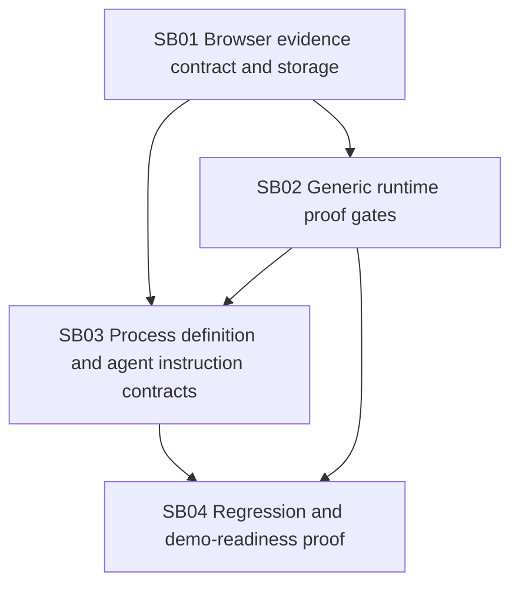

# Phase Plan

## Subbundle Dependency Map

## Critical Subbundles

- `SB01` is a critical foundation. Every downstream gate depends on durable browser evidence being represented as process artifacts instead of detached provider-native files or prose.
- `SB02` is a critical foundation. Every downstream quality/release decision depends on rejecting missing, invalid, or shallow runtime proof.
- `SB04` is process-critical closure. It proves the implementation resists the original DB failure shape and works in a clean development DB.

## Phase Gates

| Gate | Required proof | Blocks |
| --- | --- | --- |
| `G01` SB01 closure | Failing-first and passing tests show provider-native browser outputs become process artifact records when chat history is empty; proof manifest includes changed-file hashes and production behavior artifact matrix. | `SB02`, `SB03`, `SB04` |
| `G02` SB02 closure | Failing-first DB-shape test rejects missing screenshot artifacts and shallow UI proof; console phase tests distinguish active errors from post-stop disconnects. | `SB03`, `SB04` |
| `G03` SB03 closure | Seed/template/prompt tests prove generic QA steps require exact browser evidence and representative interaction without Tetris-specific process runtime logic. | `SB04` |
| `G04` SB04 closure | Clean development DB run produces process-visible screenshot/snapshot/console artifacts, records browser analytics, and cannot close with detached `.playwright-mcp` evidence only. | Final closure |

## Execution Order

1. Implement `SB01` to make browser evidence durable and process-visible.
2. Implement `SB02` to validate evidence quality, console phase, and representative interaction proof.
3. Implement `SB03` to update process definitions, agent instructions, and project-structure guidance hooks.
4. Execute `SB04` to prove the exact failure shape is closed and prepare a clean development DB for user retesting.

## Reopen Rules

- Reopen `SB01` if any later proof cites `.playwright-mcp` files without corresponding scoped process artifact records.
- Reopen `SB02` if any later QA step can pass with only screenshot mention, page-title checks, pause-only state, or unclassified console diagnostics.
- Reopen `SB03` if process definitions or prompts encode Tetris-specific runtime checks in process core.
- Reopen `SB04` if live clean-DB validation cannot show screenshot evidence in process artifacts.
