# Phase Plan

## Execution Order
Execute subbundles in numeric order from SB001 through SB033. Each critical gate must pass before downstream work starts; if a later observation weakens an earlier gate, reopen that earlier subbundle and rerun its closure proof.

## Subbundle Dependency Map

```mermaid
flowchart TD
  SB001["SB001<br/>Entry branch audit and proof intake"]
  SB002["SB002<br/>Boundary hotspot inventory refresh"]
  SB001 --> SB002
  SB003["SB003<br/>Gate A - baseline architecture guard"]
  SB002 --> SB003
  SB004["SB004<br/>Route source payload usage map"]
  SB003 --> SB004
  SB005["SB005<br/>Route candidate source payload reduction"]
  SB004 --> SB005
  SB006["SB006<br/>Gate B - route model adapter confinement"]
  SB005 --> SB006
  SB007["SB007<br/>Finalizer route input/output models"]
  SB006 --> SB007
  SB008["SB008<br/>Finalizer dispatcher alias removal"]
  SB007 --> SB008
  SB009["SB009<br/>Gate C - finalizer DTO parity"]
  SB008 --> SB009
  SB010["SB010<br/>Hydration read model and query service split"]
  SB009 --> SB010
  SB011["SB011<br/>Direct-agent binding and cooperation boundary"]
  SB010 --> SB011
  SB012["SB012<br/>Gate D - hydration parity and side-effect ownership"]
  SB011 --> SB012
  SB013["SB013<br/>Pre-execution route fact DTOs"]
  SB012 --> SB013
  SB014["SB014<br/>Materialization journal and rerun side-effect boundary"]
  SB013 --> SB014
  SB015["SB015<br/>Gate E - pre-execution/start-transition parity"]
  SB014 --> SB015
  SB016["SB016<br/>Subprocess orchestration model boundary"]
  SB015 --> SB016
  SB017["SB017<br/>Subprocess projection persistence service"]
  SB016 --> SB017
  SB018["SB018<br/>Gate F - subprocess lifecycle/projection parity"]
  SB017 --> SB018
  SB019["SB019<br/>Direct-agent execution input model"]
  SB018 --> SB019
  SB020["SB020<br/>Execution outcome route snapshot slimming"]
  SB019 --> SB020
  SB021["SB021<br/>Gate G - execution/retry/provider parity"]
  SB020 --> SB021
  SB022["SB022<br/>Projection run/detail source payload review"]
  SB021 --> SB022
  SB023["SB023<br/>Validation/projection model alignment"]
  SB022 --> SB023
  SB024["SB024<br/>Gate H - projection/validation DTO parity"]
  SB023 --> SB024
  SB025["SB025<br/>Static wrapper inventory and movement plan"]
  SB024 --> SB025
  SB026["SB026<br/>Pure-rule migration to module-local rule families"]
  SB025 --> SB026
  SB027["SB027<br/>Gate I - pure-rule parity and Core candidate list"]
  SB026 --> SB027
  SB028["SB028<br/>Driver-readiness lane map"]
  SB027 --> SB028
  SB029["SB029<br/>Driver safety and permission model draft"]
  SB028 --> SB029
  SB030["SB030<br/>Gate J - no production driver API proof"]
  SB029 --> SB030
  SB031["SB031<br/>Core extraction readiness scorecard"]
  SB030 --> SB031
  SB032["SB032<br/>Broad focused smoke matrix"]
  SB031 --> SB032
  SB033["SB033<br/>Gate K - final red-team and next cutline"]
  SB032 --> SB033
```

## Critical Subbundles
- **SB003** - Gate A - baseline architecture guard: Add/refresh architecture tests and scans proving no Process Core, no production driver API, no UI/mobile proof drift, and no collapsed execution-report rows.
- **SB006** - Gate B - route model adapter confinement: Prove route handlers/services no longer depend on hidden dispatcher payloads except in a named adapter file with documented owners and no logic beyond conversion.
- **SB009** - Gate C - finalizer DTO parity: Prove workflow/direct/recovered/subprocess finalizer paths still build the same finalizer contexts and apply transitions in the same conditions.
- **SB012** - Gate D - hydration parity and side-effect ownership: Prove hydration still returns identical subprocess/workflow/direct-agent candidates and that side effects are named, logged, and test-covered.
- **SB015** - Gate E - pre-execution/start-transition parity: Prove database block, materialization request/no-op, start-transition reload, and ContinueCandidates behavior are unchanged.
- **SB018** - Gate F - subprocess lifecycle/projection parity: Prove child-run observation, capability-gap block, terminal mirror, completed projection, gap journal, and parent finalizer behavior are unchanged.
- **SB021** - Gate G - execution/retry/provider parity: Prove direct-agent execution, retry/no-progress, provider fallback/repair, competing-execution guard, and finalizer input behavior remain stable.
- **SB024** - Gate H - projection/validation DTO parity: Prove projection source-family order, external reference keys, lineage, expected artifact satisfaction, and browser/provider-native evidence behavior are unchanged.
- **SB027** - Gate I - pure-rule parity and Core candidate list: Prove rule migration parity and update a Core-candidate inventory that says which pure decisions could move later and which must not.
- **SB030** - Gate J - no production driver API proof: Prove no IProcessDriverPack/IProcessDriverRegistry/production driver API was added; docs remain traceability-only.
- **SB033** - Gate K - final red-team and next cutline: Close the execution report, raw-note traceability, red-team review, and recommend whether the next bundle may start a narrow Process Core project.

## Phase Gates

### P1 Baseline & guardrails
- SB001: Work package - Entry branch audit and proof intake
- SB002: Work package - Boundary hotspot inventory refresh
- SB003: Critical gate - Gate A - baseline architecture guard

### P2 Route model source-payload burn-down
- SB004: Work package - Route source payload usage map
- SB005: Work package - Route candidate source payload reduction
- SB006: Critical gate - Gate B - route model adapter confinement

### P3 Finalizer application DTO boundary
- SB007: Work package - Finalizer route input/output models
- SB008: Work package - Finalizer dispatcher alias removal
- SB009: Critical gate - Gate C - finalizer DTO parity

### P4 Hydration query and direct-agent binding split
- SB010: Work package - Hydration read model and query service split
- SB011: Work package - Direct-agent binding and cooperation boundary
- SB012: Critical gate - Gate D - hydration parity and side-effect ownership

### P5 Pre-execution, materialization and start-transition refinement
- SB013: Work package - Pre-execution route fact DTOs
- SB014: Work package - Materialization journal and rerun side-effect boundary
- SB015: Critical gate - Gate E - pre-execution/start-transition parity

### P6 Subprocess runtime and projection persistence split
- SB016: Work package - Subprocess orchestration model boundary
- SB017: Work package - Subprocess projection persistence service
- SB018: Critical gate - Gate F - subprocess lifecycle/projection parity

### P7 Direct-agent execution/retry/provider adapter boundary
- SB019: Work package - Direct-agent execution input model
- SB020: Work package - Execution outcome route snapshot slimming
- SB021: Critical gate - Gate G - execution/retry/provider parity

### P8 Artifact projection and validation DTO convergence
- SB022: Work package - Projection run/detail source payload review
- SB023: Work package - Validation/projection model alignment
- SB024: Critical gate - Gate H - projection/validation DTO parity

### P9 Static wrapper and pure-rule candidate burn-down
- SB025: Work package - Static wrapper inventory and movement plan
- SB026: Work package - Pure-rule migration to module-local rule families
- SB027: Critical gate - Gate I - pure-rule parity and Core candidate list

### P10 Driver readiness without production API
- SB028: Work package - Driver-readiness lane map
- SB029: Work package - Driver safety and permission model draft
- SB030: Critical gate - Gate J - no production driver API proof

### P11 Core readiness decision and final red-team
- SB031: Work package - Core extraction readiness scorecard
- SB032: Work package - Broad focused smoke matrix
- SB033: Critical gate - Gate K - final red-team and next cutline
