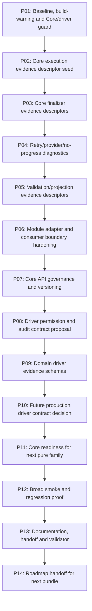

# Phase Plan

## Subbundle Dependency Map

## Phases

### P01 — Baseline, build-warning and Core/driver guard
- **SB001** — Baseline branch/proof intake and active bundle guard: Review latest report, Core API inventory, build transcripts and proof gaps.
- **SB002** — Build warning cleanup/classification: Fix or explicitly baseline the 3 current build warnings; no broad suppressions.
- **SB003** — Gate A: clean baseline proof: Build, unit architecture, no-Core-creep, no-driver, no-UI, anti-stub scans.

### P02 — Core execution evidence descriptor seed
- **SB004** — Execution evidence descriptor inventory: Map execution outcome fields that are pure facts vs application/runtime-owned fields.
- **SB005** — Add Core execution evidence descriptors: Introduce immutable Core run/attempt/proof descriptors without AgentFramework dependency.
- **SB006** — Gate B: execution descriptor parity: Adapters build descriptors from module snapshots; no execution behavior moves.

### P03 — Core finalizer evidence descriptors
- **SB007** — Finalizer intent/outcome inventory: Map workflow/recovery/direct/subprocess finalizer inputs and output/apply conditions.
- **SB008** — Add Core finalizer evidence descriptors: Describe finalizer intent/outcome facts without application or transition mutation.
- **SB009** — Gate C: finalizer evidence parity: Null-result no-apply and apply-on-result remain module-local and tested.

### P04 — Retry/provider/no-progress diagnostics
- **SB010** — Retry/provider diagnostics inventory: Classify retry, missing tool, provider fallback, repair and no-progress facts.
- **SB011** — Add Core diagnostic reason/result models: Only immutable diagnostic descriptors; no provider health calls or repair behavior.
- **SB012** — Gate D: diagnostics parity: Module adapters preserve current retry/provider/no-progress decisions.

### P05 — Validation/projection evidence descriptors
- **SB013** — Projection/validation evidence inventory: Map projection order, lineage, satisfaction, provider-native browser evidence facts.
- **SB014** — Add Core evidence descriptor models: Add stable descriptors only; keep file/storage/workspace/validation orchestration local.
- **SB015** — Gate E: projection/validation descriptor parity: Focused tests prove source order, lineage and satisfaction behavior unchanged.

### P06 — Module adapter and consumer boundary hardening
- **SB016** — Explicit Core adapter map: Create/update allowed Core consumer map and adapter ownership list.
- **SB017** — Adapter confinement tests: Reject Core usage in side-effect files outside explicit adapters.
- **SB018** — Gate F: consumer boundary: Core consumers remain explicit and dependency-clean.

### P07 — Core API governance and versioning
- **SB019** — Public API snapshot update: Reflect every public Core type/member and owner classification.
- **SB020** — Core namespace/package hygiene: Check namespace stability, no broad helpers, no mutable service APIs.
- **SB021** — Gate G: API stability: Public surface snapshot, dependency scan and architecture tests pass.

### P08 — Driver permission and audit contract proposal
- **SB022** — Permission/audit requirement model: Define future verification-only/manager-readonly/execution-capable audit requirements.
- **SB023** — Negative driver scenarios: Tests/docs deny mutation, runtime hooks, registry, DI, manager commands and shell/Graph execution.
- **SB024** — Gate H: driver proposal remains non-production: Production source driver token scans pass.

### P09 — Domain driver evidence schemas
- **SB025** — .NET/Rust evidence schema proposal: Readonly build/test/proof evidence schema, no command execution.
- **SB026** — Office/business-analysis evidence schema proposal: Readonly document/email/deliverable facts, no Graph or record mutation.
- **SB027** — Gate I: domain schemas are read-only: Docs/tests prove side-effect denial and no production driver APIs.

### P10 — Future production driver contract decision
- **SB028** — Production driver prerequisites decision: Permission enforcement, audit, sandbox, command policy and runtime ownership checklist.
- **SB029** — One-driver alpha candidate decision: Choose future verification-only alpha candidate or defer.
- **SB030** — Gate J: driver implementation decision: Explicit yes/no; default no unless prerequisites have executable tests.

### P11 — Core readiness for next pure family
- **SB031** — Core extraction scorecard refresh: Score execution/finalizer/diagnostics/projection descriptors and remaining blockers.
- **SB032** — Next pure family proposal: Pick next safe Core family or declare Core stable enough for driver-contract work.
- **SB033** — Gate K: Core readiness decision: No broad runtime extraction; proof matrix complete.

### P12 — Broad smoke and regression proof
- **SB034** — Solution build and full unit tests: Run build, full unit tests and warning scan.
- **SB035** — Focused integration matrix: Run dispatch, subprocess, artifact, finalizer, execution-client, route/core focused tests.
- **SB036** — Gate L: broad smoke closure: Source scans, anti-stub, UI/media drift scan, driver token scan.

### P13 — Documentation, handoff and validator
- **SB037** — Execution report and proof index update: All rows separate, critical manifests linked, no collapsed rows.
- **SB038** — Architect/QA/red-team review: Review code, tests, side-effect ownership and roadmap.
- **SB039** — Gate M: completed-stage validator: Prepared/completed validators pass or validation-not-run is explicit.

### P14 — Roadmap handoff for next bundle
- **SB040** — Stable Core roadmap update: Document remaining Core families and explicit non-Core areas.
- **SB041** — Driver roadmap update: Document production driver prerequisites and lane ordering.
- **SB042** — Gate N: next-bundle decision: State next work: Core expansion, driver-contract proposal or stabilization cleanup.

## Critical Subbundles

- **SB003** — gate for P01: Baseline, build-warning and Core/driver guard
- **SB006** — gate for P02: Core execution evidence descriptor seed
- **SB009** — gate for P03: Core finalizer evidence descriptors
- **SB012** — gate for P04: Retry/provider/no-progress diagnostics
- **SB015** — gate for P05: Validation/projection evidence descriptors
- **SB018** — gate for P06: Module adapter and consumer boundary hardening
- **SB021** — gate for P07: Core API governance and versioning
- **SB024** — gate for P08: Driver permission and audit contract proposal
- **SB027** — gate for P09: Domain driver evidence schemas
- **SB030** — gate for P10: Future production driver contract decision
- **SB033** — gate for P11: Core readiness for next pure family
- **SB036** — gate for P12: Broad smoke and regression proof
- **SB039** — gate for P13: Documentation, handoff and validator
- **SB042** — gate for P14: Roadmap handoff for next bundle

## Phase Gates

Every third subbundle is a gate. Downstream phases must stop if the gate fails. Gate proof must include build/test/source scan evidence appropriate to the phase.