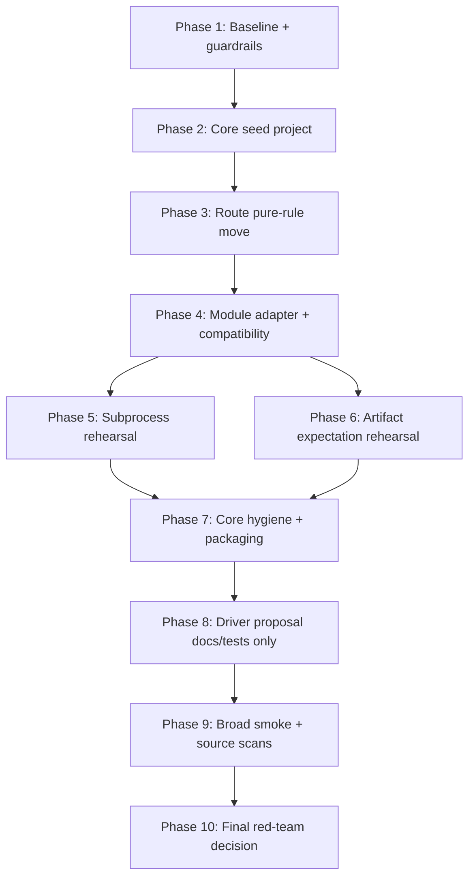

# Phase Plan

## Execution Order

- Phase 1: SB001-SB003 baseline and guardrails.
- Phase 2: SB004-SB006 Core seed project skeleton.
- Phase 3: SB007-SB009 route pure-rule move and proof.
- Phase 4: SB010-SB012 module adapter and compatibility proof.
- Phase 5: SB013-SB015 subprocess rehearsal proof.
- Phase 6: SB016-SB018 artifact expectation rehearsal proof.
- Phase 7: SB019-SB021 Core hygiene and packaging proof.
- Phase 8: SB022-SB024 driver proposal docs/tests only.
- Phase 9: SB025-SB027 broad smoke and source scans.
- Phase 10: SB028-SB030 final red-team decision.

## Subbundle Dependency Map

## Critical Subbundles

- SB003: baseline guard
- SB006: Core project guard
- SB009: route pure-rule move proof
- SB012: module adapter parity proof
- SB015: subprocess rehearsal proof
- SB018: artifact expectation rehearsal proof
- SB021: Core hygiene proof
- SB024: driver proposal no-production proof
- SB027: broad smoke proof
- SB030: final red-team decision

## Phase Gates

Each critical gate must include:

- build proof,
- focused unit tests,
- focused dispatch/route integration where applicable,
- source scan for forbidden dependencies,
- no-Core-broad / no-driver proof,
- no UI/media drift proof.
