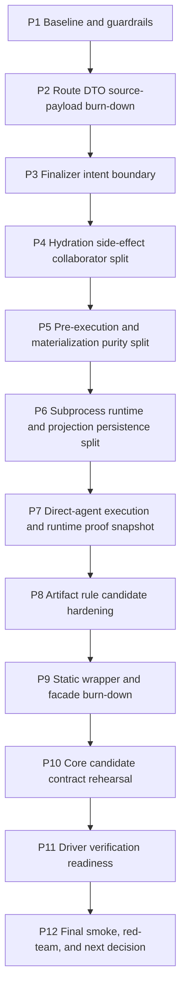

# Phase Plan

## Subbundle Dependency Map

## Critical Subbundles

- `SB003` is a critical gate for Baseline branch/proof intake and active source scan / Forbidden boundary architecture tests first.
- `SB006` is a critical gate for Split pure route DTOs from dispatcher source payloads / Route handler/service adapter confinement.
- `SB009` is a critical gate for Define finalizer intent DTOs / Constrain finalizer adapter to application edge.
- `SB012` is a critical gate for Hydration query and artifact-input readback service / Direct-agent binding/recovery/cooperation collaborator split.
- `SB015` is a critical gate for Database requirement pure decision vs transition side effect / Upstream materialization facts/rules vs journal/rerun side effects.
- `SB018` is a critical gate for Subprocess lifecycle input/read model stabilization / Subprocess projection persistence service boundary.
- `SB021` is a critical gate for Direct-agent execution input/output DTO hardening / Execution proof/readiness snapshot.
- `SB024` is a critical gate for Projection observation and expectation DTO final convergence / Pure artifact matcher/satisfaction candidate map.
- `SB027` is a critical gate for Remaining dispatcher wrapper inventory / Move only low-risk pure wrappers to owning rules.
- `SB030` is a critical gate for Draft test-only Core candidate contract map / Architecture tests for future Core allow/deny lists.
- `SB033` is a critical gate for Driver evidence manifest vocabulary documentation / Driver permission negative scenarios.
- `SB036` is a critical gate for Broad smoke matrix / Final red-team and line-count review.

## Phase Gates

### P1 Baseline and guardrails

- `SB001`: Baseline branch/proof intake and active source scan — Record current state, line counts, and previous bundle proof. No code movement.
- `SB002`: Forbidden boundary architecture tests first — Add or update tests that fail on Core/driver/UI drift and on collapsed report rows.
- `SB003`: Gate A baseline closure — Run build + focused architecture tests + source scans before production movement.

### P2 Route DTO source-payload burn-down

- `SB004`: Split pure route DTOs from dispatcher source payloads — Move source payloads into explicit envelope/adapter models so route DTOs are pure read models.
- `SB005`: Route handler/service adapter confinement — Ensure route handlers and route services consume pure DTOs; adapters exist only at dispatcher/application edge.
- `SB006`: Gate B route DTO parity — Prove route order, start transition reload, direct-agent/finalizer handoff, and no adapter leaks.

### P3 Finalizer intent boundary

- `SB007`: Define finalizer intent DTOs — Introduce route/application finalizer intents for workflow, recovery, direct-agent, subprocess.
- `SB008`: Constrain finalizer adapter to application edge — Keep dispatcher-owned finalizer context conversion in one adapter only; remove duplicate alias overloads.
- `SB009`: Gate C finalizer parity — Prove null-finalizer no-apply, apply-on-result, transition shape, workflow/recovery/direct/subprocess parity.

### P4 Hydration side-effect collaborator split

- `SB010`: Hydration query and artifact-input readback service — Separate EF readback and artifact-input preparation from candidate assembly.
- `SB011`: Direct-agent binding/recovery/cooperation collaborator split — Separate binding, manual recovery, recoverable execution, and cooperation metadata collaborators.
- `SB012`: Gate D hydration parity — Prove subprocess/workflow/direct-agent candidate defaults, project-structure access mutation, recovery ids, cooperation metadata.

### P5 Pre-execution and materialization purity split

- `SB013`: Database requirement pure decision vs transition side effect — Separate pure database blocking decision from transition execution.
- `SB014`: Upstream materialization facts/rules vs journal/rerun side effects — Keep facts/fingerprint/directive pure, journal/rerun application-local.
- `SB015`: Gate E pre-execution parity — Prove block transition, no-op, materialization request, fingerprint/dedup, and start reload behavior.

### P6 Subprocess runtime and projection persistence split

- `SB016`: Subprocess lifecycle input/read model stabilization — Make subprocess runtime consume route-owned inputs without dispatcher aliases.
- `SB017`: Subprocess projection persistence service boundary — Separate child-artifact query, gap journal, parent artifact write, and save changes.
- `SB018`: Gate F subprocess parity — Prove capability gap, observing state, terminal mirror, completed projection, parent finalizer, lineage.

### P7 Direct-agent execution and runtime proof snapshot

- `SB019`: Direct-agent execution input/output DTO hardening — Remove full dispatcher payloads from direct-agent runtime boundary except one adapter edge.
- `SB020`: Execution proof/readiness snapshot — Create slim execution proof snapshot for route/finalizer/driver-readiness documentation.
- `SB021`: Gate G execution parity — Prove retry, provider repair, no-progress, competing execution, finalizer detail compatibility.

### P8 Artifact rule candidate hardening

- `SB022`: Projection observation and expectation DTO final convergence — Remove remaining duplicate expectation/projection/validation DTO conversions.
- `SB023`: Pure artifact matcher/satisfaction candidate map — Group pure matcher/satisfaction rules without moving storage/workspace/persistence.
- `SB024`: Gate H artifact parity — Prove projection order, lineage, keys, satisfaction, provider-native browser evidence, validation behavior.

### P9 Static wrapper and facade burn-down

- `SB025`: Remaining dispatcher wrapper inventory — Classify every remaining dispatcher wrapper as pure, application, infrastructure, or compatibility.
- `SB026`: Move only low-risk pure wrappers to owning rules — Remove callers from dispatcher static facades where pure owners already exist.
- `SB027`: Gate I wrapper parity — Prove no facade resurrection, no side-effect movement into pure rules, and all tests green.

### P10 Core candidate contract rehearsal

- `SB028`: Draft test-only Core candidate contract map — Create bundle-only contract map for first future Core project; no production Core project.
- `SB029`: Architecture tests for future Core allow/deny lists — Add/adjust tests that will guard future Core dependencies but do not create Core.
- `SB030`: Gate J Core rehearsal closure — Prove contract map is docs/tests only and production source unchanged except tests/guards.

### P11 Driver verification readiness

- `SB031`: Driver evidence manifest vocabulary documentation — Define verification-only evidence manifests for route/artifact/runtime/domain helpers.
- `SB032`: Driver permission negative scenarios — Document and test-scan that no production API/registry/DI/runtime hook exists.
- `SB033`: Gate K driver readiness closure — Prove all driver work remains documentation/test-only.

### P12 Final smoke, red-team, and next decision

- `SB034`: Broad smoke matrix — Run build, full unit tests, focused integration suites, source scans.
- `SB035`: Final red-team and line-count review — Review whether a narrow Core proposal is now justified; list exact blockers if not.
- `SB036`: Gate L final closure — Complete execution report, final Core readiness decision, driver readiness decision, and proof index.

