# Phase Plan

## Subbundle Dependency Map

```mermaid
flowchart TD
    SB001 --> SB002 --> SB003
    SB003 --> SB004 --> SB005 --> SB006
    SB006 --> SB007 --> SB008 --> SB009
    SB009 --> SB010 --> SB011 --> SB012
    SB012 --> SB013 --> SB014 --> SB015
    SB015 --> SB016 --> SB017 --> SB018
    SB018 --> SB019 --> SB020 --> SB021
    SB021 --> SB022 --> SB023 --> SB024
    SB024 --> SB025 --> SB026 --> SB027
    SB027 --> SB028 --> SB029 --> SB030
    SB030 --> SB031 --> SB032 --> SB033
    SB033 --> SB034 --> SB035 --> SB036
```

## Phases

| Phase | Subbundles | Theme |
| --- | --- | --- |
| 1 | SB001-SB003 | Baseline and Core guard hardening |
| 2 | SB004-SB006 | Subprocess lifecycle pure Core extraction |
| 3 | SB007-SB009 | Subprocess artifact mapping pure Core extraction |
| 4 | SB010-SB012 | Artifact expectation read-model Core extraction |
| 5 | SB013-SB015 | Artifact matching and satisfaction pure-rule Core extraction |
| 6 | SB016-SB018 | Module adapter and compatibility boundary |
| 7 | SB019-SB021 | Route/Core API hygiene and no-broadening proof |
| 8 | SB022-SB024 | Process module integration and parity matrix |
| 9 | SB025-SB027 | Core contract docs and extraction scorecard |
| 10 | SB028-SB030 | Driver proposal docs/tests only |
| 11 | SB031-SB033 | Broad build/unit/focused integration smoke |
| 12 | SB034-SB036 | Red-team, completed validator, final closure |

## Critical Subbundles
SB003, SB006, SB009, SB012, SB015, SB018, SB021, SB024, SB027, SB030, SB033, SB036.

## Phase Gates
Every critical subbundle must have:
- Build proof.
- Focused unit proof.
- Focused integration or parity proof if production behavior moved.
- Forbidden Core dependency scan.
- Production driver token scan.
- No UI/media drift scan.
- Anti-stub scan.
- Individual execution-report row.
