# Phase Plan

## Execution Order

- Execute subbundles in numeric order from SB001 through SB027.
- Stop at each critical gate before starting the next phase.
- Reopen the owning phase if a later observation weakens earlier behavior proof.

## Timeline

```mermaid
gantt
    title Process Core Readiness Multi-Area Isolation
    dateFormat  X
    section P1 Baseline and guardrails
    SB001, SB002, SB003 : 0, 6
    section P2 Route adapter burn-down
    SB004, SB005, SB006 : 6, 6
    section P3 Candidate hydration decomposition
    SB007, SB008, SB009 : 12, 6
    section P4 Pre-execution and transition services
    SB010, SB011, SB012 : 18, 6
    section P5 Subprocess runtime and projection isolation
    SB013, SB014, SB015 : 24, 6
    section P6 Finalizer and failure closure models
    SB016, SB017, SB018 : 30, 6
    section P7 Artifact validation and static wrapper burn-down
    SB019, SB020, SB021 : 36, 6
    section P8 Route/projection model readiness
    SB022, SB023, SB024 : 42, 6
    section P9 Core/driver readiness closure
    SB025, SB026, SB027 : 48, 6
```

## Subbundle Dependency Map

### P1: Baseline and guardrails

Make the current state measurable before moving more code.

Owns: SB001, SB002, SB003

### P2: Route adapter burn-down

Move route services from dispatcher forwarding to owned collaborators where safe.

Owns: SB004, SB005, SB006

### P3: Candidate hydration decomposition

Split hydration into query, input, assignment, binding, recovery, and assembly services.

Owns: SB007, SB008, SB009

### P4: Pre-execution and transition services

Clean database/materialization/start transition boundaries.

Owns: SB010, SB011, SB012

### P5: Subprocess runtime and projection isolation

Separate subprocess orchestration, child-run observation, projection persistence, and claim checks.

Owns: SB013, SB014, SB015

### P6: Finalizer and failure closure models

Decouple finalizer application and exception closure from dispatcher nested model aliases.

Owns: SB016, SB017, SB018

### P7: Artifact validation and static wrapper burn-down

Move remaining pure wrapper logic and rule families away from dispatcher static surface.

Owns: SB019, SB020, SB021

### P8: Route/projection model readiness

Reduce residual nested alias adapters and prepare module-local contracts for later extraction.

Owns: SB022, SB023, SB024

### P9: Core/driver readiness closure

Produce final go/no-go matrix, proof, red-team, and next bundle cutline.

Owns: SB025, SB026, SB027

## Critical Subbundles

- SB003: baseline architecture guard.
- SB006: route service ownership proof.
- SB009: hydration parity proof.
- SB012: pre-execution/start transition proof.
- SB015: subprocess runtime/projection proof.
- SB018: finalizer/failure proof.
- SB021: wrapper/rule proof.
- SB024: model readiness proof.
- SB027: final red-team, proof closure, and next bundle cutline.

## Phase Gates

- No downstream phase may start until the previous critical gate has passing proof.
- If a moved service changes behavior, reopen the phase that introduced that service, not just the final gate.
- Every gate must include build, focused tests, source scans, anti-stub scan, no Core/no driver scan, and no UI/mobile proof scan.
