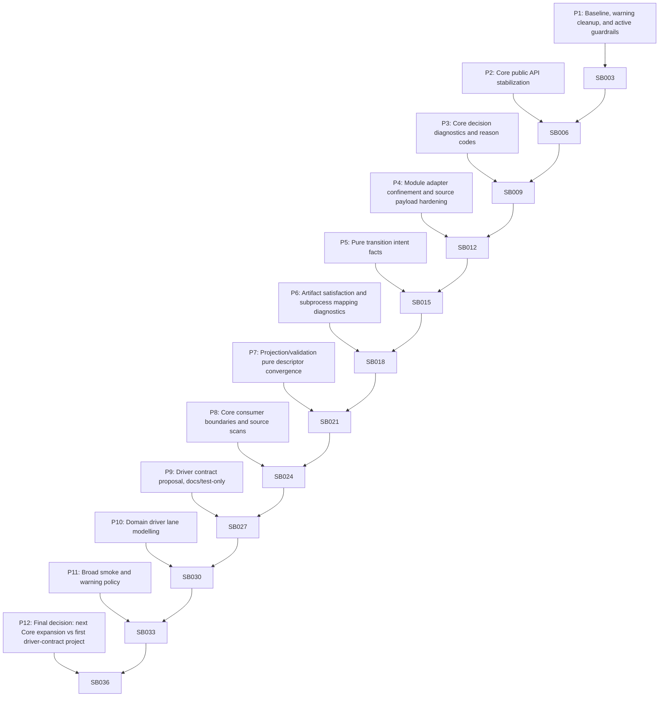

# Phase Plan

## Summary

This bundle uses 12 broader phases and 36 substantial subbundles. It is designed to advance from narrow Core pure-rule expansion toward a stable Process Core and future domain drivers without creating production driver APIs yet.

## Subbundle Dependency Map

## Critical Subbundles

- `SB003`: Gate A - clean baseline and warning policy
- `SB006`: Gate B - Core API stability proof
- `SB009`: Gate C - diagnostics parity proof
- `SB012`: Gate D - adapter confinement proof
- `SB015`: Gate E - transition intent parity
- `SB018`: Gate F - artifact/subprocess diagnostics proof
- `SB021`: Gate G - projection/validation descriptor proof
- `SB024`: Gate H - Core consumer boundary proof
- `SB027`: Gate I - driver proposal remains non-production
- `SB030`: Gate J - domain lane closure
- `SB033`: Gate K - broad smoke closure
- `SB036`: Final closure and handoff

## Phase Gates

- `SB003` must pass before downstream phase work continues.
- `SB006` must pass before downstream phase work continues.
- `SB009` must pass before downstream phase work continues.
- `SB012` must pass before downstream phase work continues.
- `SB015` must pass before downstream phase work continues.
- `SB018` must pass before downstream phase work continues.
- `SB021` must pass before downstream phase work continues.
- `SB024` must pass before downstream phase work continues.
- `SB027` must pass before downstream phase work continues.
- `SB030` must pass before downstream phase work continues.
- `SB033` must pass before downstream phase work continues.
- `SB036` must pass before downstream phase work continues.